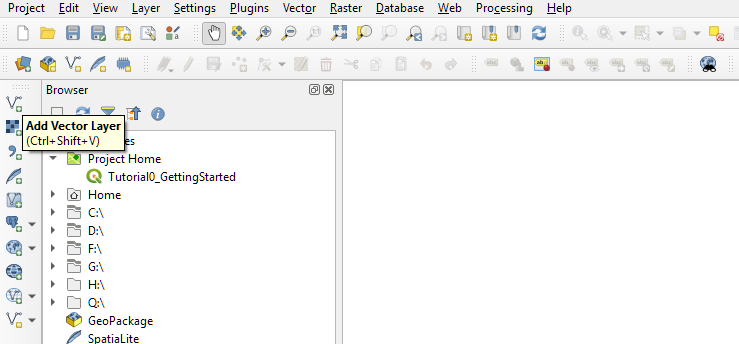
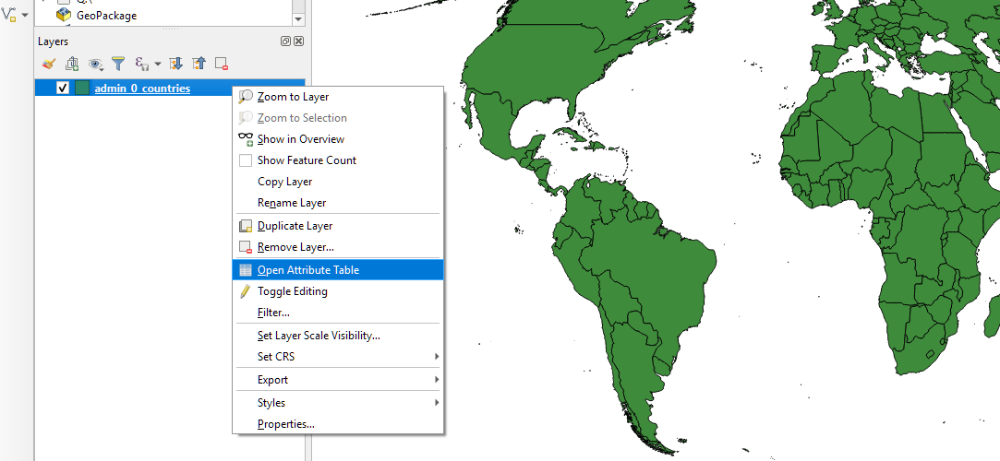
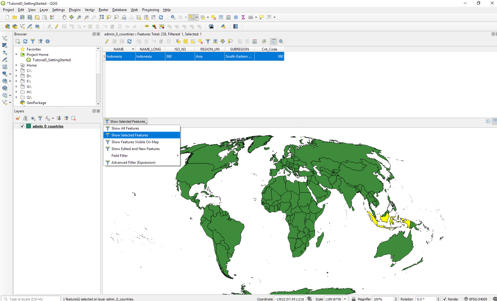
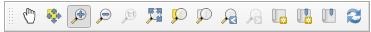
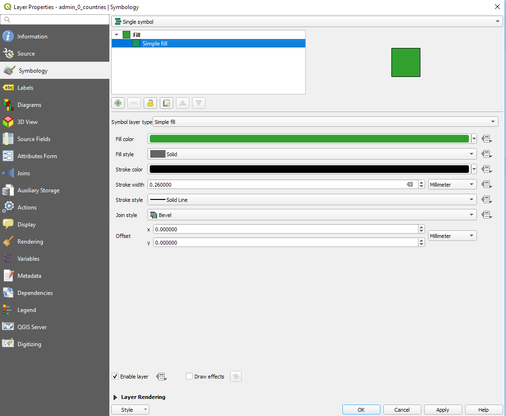
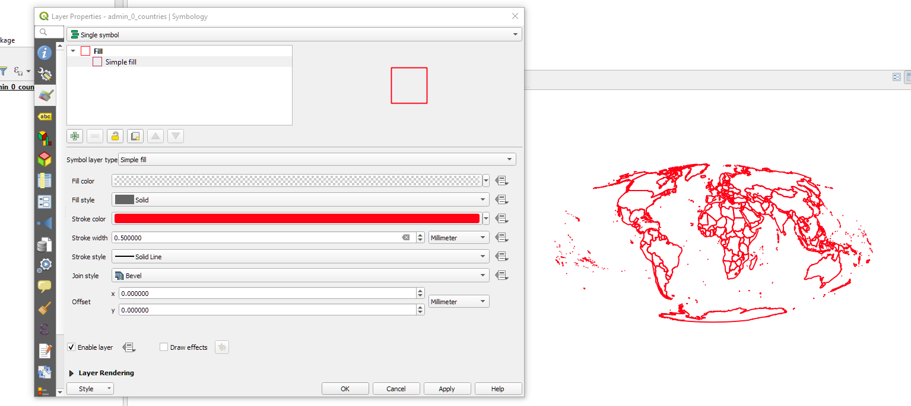

---
- Topics covered:
  - working with spatial data 'locally' (in a desktop environment) with QGIS
  - start and save a map project
  - add vector and raster spatial data to the map project from different sources
    - your hard drive
    - over the network
  - access the Attribute Table of a vector layer
  - change the symbology of a vector layer using qualitative attributes
- Changes needed:
  - move section on changing projections to Tutorial 2
---
# Organizing and Viewing Spatial Data in QGIS

## Objectives

This tutorial is meant to introduce QGIS as a tool for working with spatial data on your own computer. We'll review the interface and some of the program's options. Next you'll learn to create a project and add data from a variety of sources. Finally, we'll look at how to view attributes for the data you added, and control the appearance of data on the map.

## Setup

Before starting, you'll need to download and install QGIS. While the tutorials use version 3.4, you're welcome to experiment with any other 3.* version. Just be aware that your interface may not look exactly the same as the tutorial screenshots.

Next you'll need to set up a project folder and download the necessary data for the tutorials. Students are strongly encouraged to create a single project folder for the entire class and keep data for the various tutorials saved in the same place. Download the GitHub repository for this course from [this link](link-to-repo-zip). Save and decompress the downloaded folder to your preferred working location. The Class_Data folder will then have most of the datasets needed for tutorials. Additional datasets required for the tutorials (those larger than certain upload limits allow) can be found in [this public google drive folder](https://drive.google.com/drive/u/1/folders/1yJlnKJy1WxAXuox4nmBxrs6xlwPK1HLb), including the georectified scanned map image included later in this tutorial. Download, save, and decompress this folder to the same directory as the GitHub repository you saved.

## First Steps in QGIS

**Launch** QGIS. Your new blank map project will look like this:

Begin to familiarize yourself with the interface. Yours may not exactly resemble the layout shown above. For instance, most toolbars and panels are movable, allowing you to set up your workspace as you like. You can always add or remove these elements of the workspace by clicking through "View > Panels or Toolbars" (from the main menu bar). If you ever need to reset the interface to its default settings, you can go to "Preferences > System > Settings > Reset user interface to default settings".

### Interface Elements

1. **The Menu Bar:** This is a standard menu bar that gives you access to many elements of the software. Note that many of the items you can access here can also be accessed through the icons on the toolbars below.
2. **Toolbar:** Gives access to many commonly used tools and features in QGIS. The individual toolbar segments can be moved – hover over the edge of the toolbar until a + icon appears then click and drag the tool bar. Note the location and configuration of the elements of the toolbar on your screen might not match those in this tutorial. Please feel free to move them to which ever configuration is easiest for you to work with.
    - Note if you ever lose one element of the tool bar you can right click (control + click on Mac) in any empty zone of the toolbar area and a full list of available toolbar elements will appear.
3. **The Map View:** This is where your maps will appear, all layers activated in the layer menu (see item 4) will be visible here. 
4. **Layer menu:** This shows all of the data layers you have added to your current map project. The order of the layers in this menu determines the order in which the layers appear in the map view. The check boxes next to each layer name allows you to turn the visibility of layers on and off. By clicking a specific layer you can access properties for that layer and perform operations on that layer. This is sometimes also referred to as the Map Legend or the Table of Contents. It is not fixed, you can drag the layer menu to occupy a different space on your screen or to take up the full left hand panel.  
5. **Browser:** the browser allows you to access your computer’s file system. You can use this to drag files onto your map project.  Like the layer menu it can be moved to occupy a different space.
6. **Status Bar:** the status bar shows the position of your cursor in the map view, the current scale and rotation of the map view, and the project’s coordinate system.

* If you hover over any button in the interface a brief description of that button will appear. This is called a **tooltip**. In QGIS, if you want a description of a specific element of the interface, select the "What's This?" button circled in blue and click anywhere in the interface for a brief description of that element.

**Save** your (currently empty) map project in your working folder by clicking through `Project > Save As...` on the main menu. Name the project file Tutorial0_GettingStarted. (The .qgz extension for QGIS project files will be added to your file name automatically.)

If your interface defaults to a list of Recent Projects, double-click the newly created project file name to access and open it.

You should notice your project added to the Brower Panel, in a folder collection named Project Home.

## Adding Data

Next we'll add some data to our project.

QGIS provides an environment for viewing and manipulating spatial data but the program itself does *not handle data storage*.

layers stored elsewhere are assembled within a **map project** where we can visualize, compare, manipulate, and analyze them together. Within the map project, we can also compose and export a map. Storing your data outside of the project allows you to include a particular data layer in several map projects without having to produce multiple copies of it, but it carries two important implications:

  1. Maintaining clear file organization is important. The data layers associated with your map projects are **linked** to each project from their stored location. If those files are moved or reorganized, then their links will break and you will need to re-establish their linkage.
  2. GIS software is continuously reading the path to each data layer, accessing the information stored within your datasets. To enable this reading smoothly, we highly recommend a policy of **no spaces in your path or file names**.

Like other CAD and graphics software, elements of our map are referred to as **layers** in QGIS. Besides letting us separate and name different groups of information within a project, layers in GIS also correspond to individual data sources.

We will add a few different data layers to our map project, some which we will ultimately use in our new map and another for comparison, as a means of learning to navigate the interface.  

### Raster Layers from TIFF
Lastly, **add** a new layer to your map project by, once again, accessing the Data Source Manager dialogue box. (You can click the Add Raster button from the toolbar or simply navigate to the Raster panel if you chose a different option.)

Just as when we added the original vector polygon layer, **navigate** to your data using the browse (`...`) button. **Add** the GeoTIFF file called DensityRec.tif located in the Tutorial0_ClassData\raster\ folder. (This dataset is provided in the auxiliary download for large files. You can find it directly [here](https://drive.google.com/drive/u/1/folders/1yJlnKJy1WxAXuox4nmBxrs6xlwPK1HLb). The cropped and georectified map should align fairly well with the national boundaries layer in your map project.

To finish, **arrange** your data layers (click and drag in the Layers panel), placing the current national boundaries over the 1958 map, and **change the national boundary symbols** such that they are transparent.

### Raster Tile Layers from WTMS

When 

use https://maps.nyc.gov/tiles/

### Vector Layers from Shapefiles

There are several ways to add data to a map project. We will begin by using the "Add Vector Layer" button located on the Manage Layers Toolbar. If this toolbar is not present, remember you can access it by clicking through "View > Toolbars > Manage Layers Toolbar" from the main menu. (In the screenshot below, the Add Vector Layer button is the first.) Hover your cursor over each option to note their range.

**Click** the Add Vector Layer button to open the Data Source Manager dialogue box and access the Vector options. There, you can **navigate** to the `Tutorial0_ClassData/Shape/` folder, which contains the vector shapefile layer we will use for this project, by clicking the Browse `...` button highlighted in red below. (Alternatively, you an always use the Browse option to navigate through your files.)

There are a number of different file extensions here that may be unfamiliar. Shapefiles are collections are separate files that describe different information or perform specific roles. The primary component files are as follows:

- .shp - The main file that stores the feature geometry (required).
- .shx - The index file that stores the index of the feature geometry (required).
- .dbf - The dBASE table that stores the attribute information of features (required).
- .sbn and .sbx - The files that store the spatial index of features.
- .prj - The file that stores the coordinate system information.
- For more information on these extensions and others see [this explanation by ESRI](http://webhelp.esri.com/arcgisdesktop/9.2/index.cfm?TopicName=Shapefile_file_extensions).

The files associated with a shapefile must stay together in the same folder, otherwise QGIS will not be able to load the layer (for the required files) or may not read it properly.

We will add the admin_0_countries shapefile (`admin_0_countries.shp`). Select the file and click Open.

Confirm that the appropriate file is named in the Vector Dataset(s) path in the Data Source Manager dialogue box and **click Add.**

The Coordinate Reference System Selector dialogue box will appear asking that you confirm (or specify) the coordinate system of the dataset you are adding to your map project. This layer is projected with the Mollweide *projection* based on the World Geodetic System of 1984 (WGS1984) *datum*. Read through the information in the dialogue box confirming this.

**Click OK** in the Coordinate Reference System Selector dialogue box to add the layer to your map project.

**Click Close** in the Data Source Manager dialogue box to exit it.

The layer should appear in your map project as shown below. Note that the colors associated with each polygon feature (in this case depicting national boundaries) is the same for all features in the layer, and the color assigned is arbitrary.

**Save** your map project.

The layer name appears listed in the Layers Panel, along with a swatch of its symbol. You can **toggle** layers on and off by clicking the check-mark next to their name, allowing you to choose which are visible when multiple layers are added to a project. Further, you can arrange the order in which the layers are rendered by reordering the list (simply click and drag to reorder).

### Vector Layers from GeoJSON

### Vector Layers from 

use http://gisrevprxy.seattle.gov/arcgis/rest/services/DPR_EXT/ParksExternalWebsite/MapServer

http://gisrevprxy.seattle.gov/arcgis/rest/services/DPR_EXT/ParksExternalWebsite/MapServer

Once you're done adding data, it's probably a good idea to save your project.

## Viewing Attributes

### Open the Attribute Table

To access the *Attribute Table* of associated with a vector feature class (and thus inspect the attributes of each feature), **right-click** on the layer name in the Layers panel and **select** Open Attribute Table.

The layer's Attribute Table will appear, allowing you to inspect the information contained in the shapefile per feature. In the case of this basic administrative boundary layer, it contains information commonly used to identify countries. In the screenshot below, the table is sorted by the Name *field* (click on the field *header* to sort). The first feature is *selected* (click on the row label -- in this case, "1"). The corresponding polygon feature is also selected within the map project's *data frame*.

The attributes of this country-level dataset include the short and long-form names of each country in two separate *text* or *string* fields. Two additional text fields describe the global region and subregions (here, determined by the UN) to which each country belongs. Lastly, there are two separate fields denoting the ISO three-digit country code. The ISO_N3 field indeed includes three digits (with placeholder zeros where needed) and the Cnt_Code field does not. In this case, the ISO_N3 field contains text and the Cnt_Code field is numeric. Thus, while the ISO_N3 field appears to contain numeric information, the software does not interpret it as such and would be unable to perform mathematical operations on that field. (Remember that all information contained within a field is of a single data type.)

To **deselect** any selected features, click the Deselect All button on the Attribute Table's toolbar (or on the Attributes Toolbar).

#### On your own: Interactively Selecting and Inspecting Features and Attributes

Interactively select features in the Attribute Table to highlight the corresponding polygon in the data frame.

Of course, the relationship between the geometry and attributes of a feature works in the opposite direction as well. Using the Selection Tool from the Attributes Toolbar (chosen in the screenshot below), you can also interactively select polygons and highlight them in the Attribute Table. Further, you can isolate selected features from the table: choose Show Selected Features from the the Attribute Table's filter drop-down menu.

Notice in the screenshot above that Indonesia is selected. From the Attribute Table we can see that the many polygons representing the area of Indonesia collectively represent only one feature in the dataset. This is an example of a *multipart polygon*.

While exploring, you can zoom and pan across the map's data frame with the tools included in the Map Navigation Toolbar (below) or by scrolling (to zoom) and holding (to pan) your middle mouse button.

**Deselect** any selected features. Return your map to its full extents by **clicking the Zoom Full button**. **Save** your QGIS map project.

### Intro to Symbology
We will discuss map *symbology* and cartography more completely later in the workshop, but for now, we will learn to make a few simple changes to the appearance of the national boundaries layer. First, we will change the default *symbol* used to visualize the data layer. Second, we will assign colors to each polygon based on a qualitative field in its attribute table (in this case, the subregion designation).

There are a few short-cut options in the QGIS interface for quickly changing a layer's symbols. We will walk through the Layer Properties dialogue box, which includes these and many more options and functions per layer.

#### Accessing Symbology Properties
To access the Layer Properties dialogue box, **right-click** on the layer name (`admin_0_countries`) in the Layers Panel and choose **Properties**.

From the lelf-hand menu, choose the **Symbology** menu. You should notice that the layer is currently symbolized with a "Single Symbol" system and a "simple fill." **Highlight** "Simple Fill" from the panel at the top of the dialogue box to access the symbol options.

#### Changing a Single Symbol
Take a moment to read through the various options and to experiment with an alternative symbol. **Note** that these options are tailored to a polygon feature class. (Polyline layers, for example, would not have "fill" options.) You can specify the color and style of the polygon fill and the color and width of the polygon stroke (outline).

**Click** Apply to apply your changes. When you are satisfied with your decisions, **click** OK to save them and close the Properties dialogue box. In the example below, the features have a transparent fill and a heavy, red stroke.

#### Qualitative or Categorical Symbology
We can also use the layer's attributes to organize or categorize the map's symbology. To do this, access the Layer Properties (Symbology menu) dialogue box again and specify **Categorized** symbols from the drop-down menu at the top of the dialogue.

The symbology options will change, and from here we can quickly assign separate symbols to each feature within unique groups described in the Attribute Table. In this case, we will effectively color-code our polygons based on their subregion.

1. From the Column drop-down menu, **select** the SUBREGION field. **Note** that this menu includes each of the different fields included in the layer's attribute table.
2. **Confirm** that the Color Ramp option is set to Random Colors. (If it is not, you can select it by clicking the drop-down menu.)
3. Next, **click** the Classify button toward the bottom of the dialogue box to populate the panel with each unique value from the SUBREGION field. The Symbol list should automatically include each of the subregions listed in our dataset, with unique (randomly generated) color values.
4. **Click Apply** to apply your symbology changes.

**Note** some of the options here. Each of the category symbols can be individually altered by double-clicking the color symbol swatch in the list. Categories can be toggled on or off (rendering features with those attribute values visible/invisible) or removed from the list altogether.

When you are satisfied with your categorical symbology strategy, **click OK** to exit the Layer Properties dialogue box.

**Save** your QGIS project.

### Finishing Up
Thus far, we have been interacting with a Mollweide map projection. Before finishing this tutorial, we will reproject the map data frame to match the original projection of a scanned, *georectified* global population map.

The georectified map (below) we will add to our project is from the [David Rumsey Historical Map Collection] (https://www.davidrumsey.com/luna/servlet/detail/RUMSEY~8~1~225244~5505992;JSESSIONID=fa751117-cbd7-452b-b867-46dac48ea52f#). The map is drawn in the Winkel Tripel projection, which is now commonly used in global atlases for its minimal distortion in distance, area, and direction.

---

Tutorial adapted from materials from [Mapping for the Urban Humanities](https://github.com/CenterForSpatialResearch/mapping_for_the_urban_humanities), taught by Bernadette Baird-Zars, Eric Glass & Leah Meisterlin in Summer 2019.
