## Objectives

This tutorial is meant to introduce QGIS as a tool for working with spatial data on your own computer. First we'll review the interface. Next you'll learn to create a project and add data from a variety of sources. Finally, we'll go over how to view **features** and **attributes** of the data you added, and control the appearance of data on the map.

## Setup

Before starting, you'll need to download and install QGIS. While the tutorials use version 3.4, you're welcome to experiment with any other 3.* version. Just be aware that your interface may not look exactly the same as the tutorial screenshots.

Since this series of tutorials is set up as a set of exercises around a common collection of data and culminating in a final project, you'll want to set up a **project folder** before getting started. All members of the Columbia community have access to unlimited storage on Google Drive, if you don't already do so, we recommend you use make use of this resource to back up your project folder through the [Backup and Sync](https://www.google.com/drive/download/backup-and-sync/) tool provided by Google.

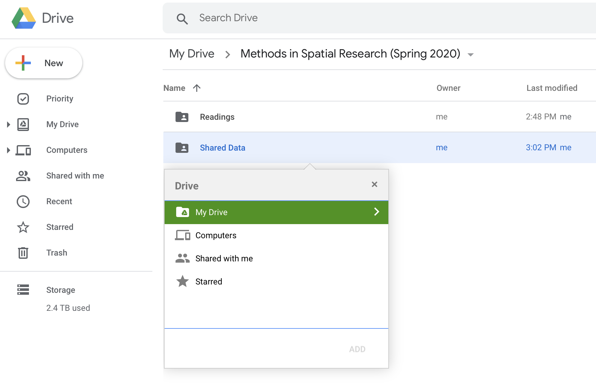

Once your project folder is set up and syncing, go to the [Methods in Spatial Research](https://drive.google.com/drive/folders/1IVjKSGSpNVmGB6r6zkiWuKoeryMfxZow?usp=sharing) folder in your browser. Click the folder labeled "Shared Data" to select it, and press `Shift + Z`. In the pop-up window, navigate to your project folder and then click "Add". This will create an instance of the shared data folder for the class within your project that will automatically keep itself updated if the data should change. In your project folder, also create a folder labeled "My_Data". This is where you'll store datasets you create yourself in Weeks 3 and 4.

## The QGIS Interface

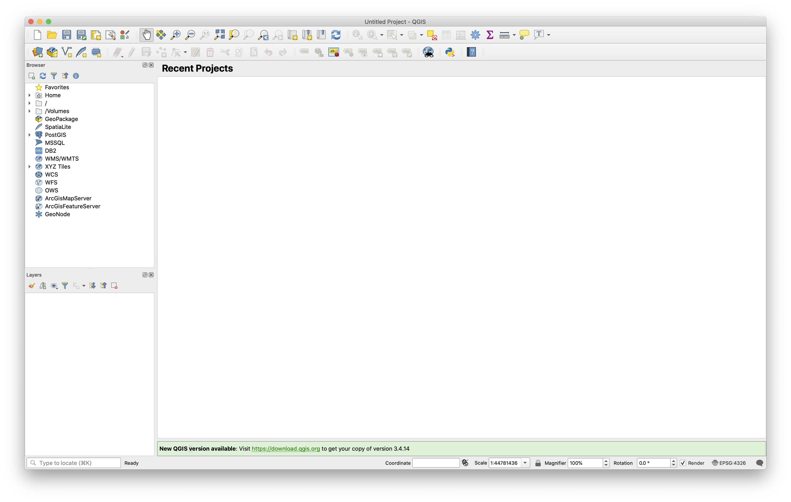

When you first launch QGIS, it opens a new blank map project as illustrated in the screenshot above. The following list outlines the most important interface elements:

1. The **Menu Bar** is a standard menu bar that gives you access to most of the software's functionality. On a Mac this will be at the top of your screen; on Windows it's attached to the top of the QGIS window itself. Note that many of the items you can access here can also be accessed through the icons on the toolbars below.
2. **Toolbars** give access to many commonly used tools and features in QGIS, grouped by function. To open additional toolbars (or reopen them if they are accidentally closed), right-click in the space around an existing toolbar and select one from the list that appears.
3. The **Map View** is where your data will appear, according to the settings defined in each layer.
4. The **Layer Panel** shows all of the data layers you have added to your current map project. The order of the layers in this menu determines the overlapping order in which the layers appear in the map view (higher items on the list appear on top). The check boxes next to each layer name allows you to turn the visibility of layers on and off. You can also access properties for that layer and perform operations on it by right-clicking the layer name. This is sometimes also referred to as the Map Legend or the Table of Contents.
5. The **Browser Panel** contains a list of data sources on your computer's file system (represented by folder icons) and various network sources (each has a different blue-hued icon). Folders and other sources can be expanded by clicking the triangles to the left of each icon. Anything here that can be read by QGIS as a layer can be added to the project by dragging it to the Layer Panel or Map View.
6. Finally, the **Status Bar** shows the position of your cursor in the map view, the current scale and rotation of the map view, and the project’s coordinate system. When working with large datasets, you can also pause/resume map drawing with the "Render" checkbox.

Hovering over any button in the interface will display a **tooltip** with a brief description. More details can be found in the [QGIS Documentation](https://docs.qgis.org/3.4/en/docs/user_manual/introduction/qgis_gui.html).

Once you're familiar with the standard interface layout, you may want to customize your workspace. Toolbars and Panels can be turned on or off by right-clicking blank space next to existing toolbars (see above) or through the menu bar under View > Toolbars or View > Panels. They can also be repositioned by clicking and dragging anywhere in the panel frame or from the handle to the left of each toolbar. Each element can be either docked (snappable areas will be highlighted in blue as you drag around the window) or undocked/freely positioned. If you ever need to reset the interface to its default settings, you can do so under Preferences > System > Settings > Reset user interface to default settings.

## Creating and Accessing Projects

Before beginning a new project, **Save** your (empty) tutorial file in the project folder you set up earlier. Like most programs, QGIS lets you save either with Ctrl-S, a toolbar button (look for the blue floppy disk) or through the Menu Bar (Project > Save). Name the file `Tutorial1_GettingStarted`. The `.qgz` extension for QGIS files will be added to your filename automatically.

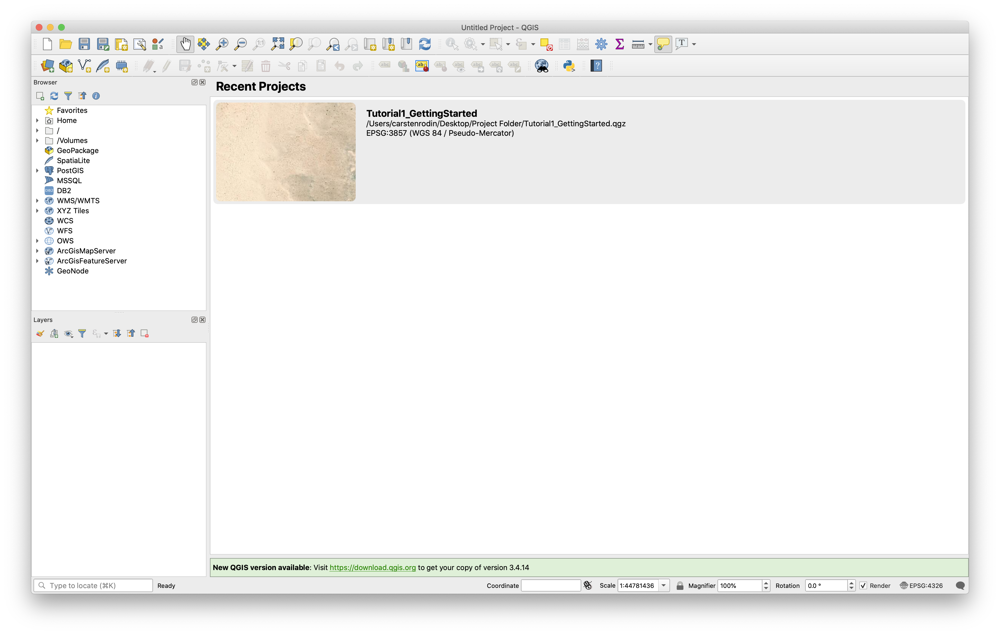

Quit and relaunch QGIS. This time, instead of a new empty project you should see a list of Recent Projects in the Map View. Double-click to reopen your tutorial file. Notice that your project folder has now been added to to the Brower Panel, shown with a green folder icon as "Project Home". If you expand the folder, you should see your "My_Data" and "Shared_Data" folders along with your tutorial file.

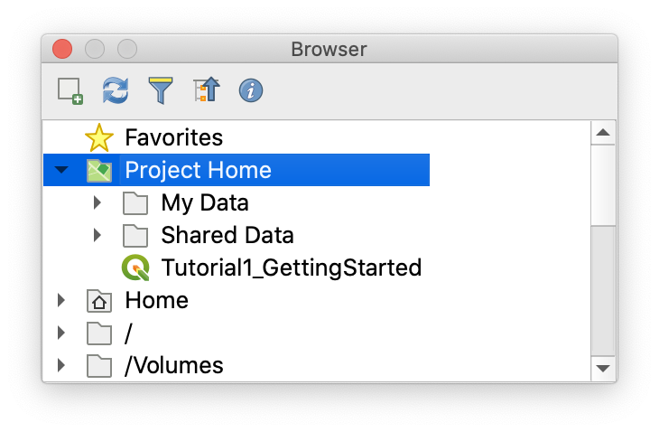

## Adding Data

Now we're ready to add some data to our project.

QGIS provides powerful tools for manipulating and rendering spatial data but **the program itself does not handle data storage**. Instead, when you add data to a map in QGIS, it creates a new **layer** containing a link to wherever the data is actually stored. Every time the program needs to draw, look up, or write data associated with that layer, it accesses it through the link. This has many benefits:

- You can produce multiple maps using the same data
- The data can be updated or revised independently of the map
- Using a network, multiple mapmakers can share a pool of data resources

At the same time, this approach also requires the mapmaker to think strategically (or even spatially) about where your data is coming from.

When creating your own data and storing it locally, extra care is needed to make sure this linked approach is successful. First, maintaining **clear and consistent file organization is extremely important**. Once a link is established, moving, reorganizing or renaming files will require you to re-link each one. Second, **spaces or unusual characters within the file path can cause errors** in some spatial analysis software. Because of this it is recommended that you limit all file and folder names to letters, digits and underscores.

In the next few sections we'll look at a couple of different ways to add data to your map.

### Raster Tiles (XYZ, WMTS and others)

When starting a new mapping project, getting a sense of context and orientation is often important. A set of **map tiles**, made available through a web server, can provide coverage of the earth's entire surface at varying levels of detail required by different zoom levels. This technique is behind most online map services but can also be used within QGIS alongside other forms of data. Here we'll make a connection to [Stamen Design](http://maps.stamen.com/#toner/)'s *Toner* tileset (generated from [OpenStreetMap](https://en.wikipedia.org/wiki/OpenStreetMap) Data) and add it to our map.

In the Browser Panel, right-click "XYZ Tiles" and select "New Connection". Give your new connection a name like "Stamen Toner", and paste the following URL into the URL field:

`http://a.tile.stamen.com/toner/{z}/{x}/{y}.png`

Now you should see an entry for Stamen Toner appear under XYZ Tiles when expanded. Click and drag this service into your Layers Panel or Map View and you'll see something like the image below. Notice how the map redraws at specific zoom levels, revealing or removing detail.

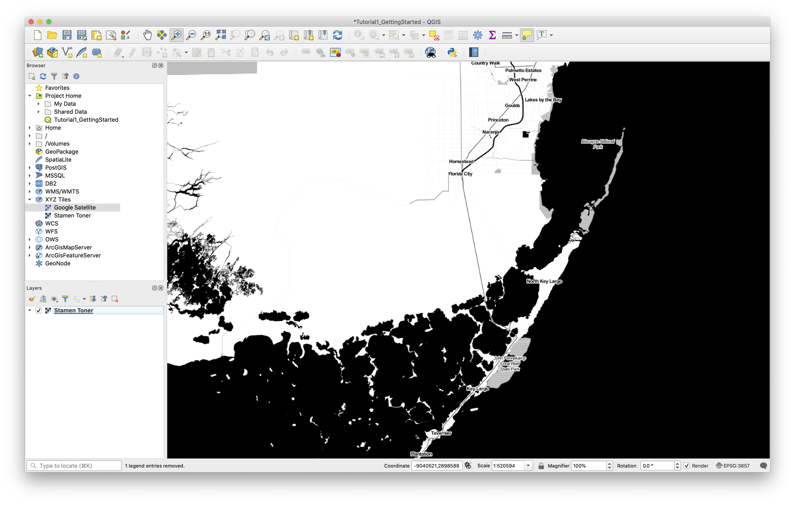

The data we get from the tileserver is **raster** data. This means the area shown in our map is continuously covered with an even grid of pixel-like **cells**, each one enclosing a discrete unit of geographic space. Each raster cell in the Toner tile set is colored either black or white. Try changing the zoom level of the map using the scroll wheel on your mouse or using the tools in the Zoom toolbar. As we jump between zoom levels, the tile server sends down new raster tiles with varying spatial resolutions; when we zoom in, each cell represents a smaller and smaller portion of the territory.

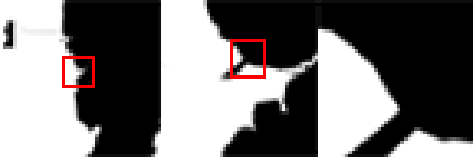

### Raster Layers from TIFF

Another way to add raster data is from a single .tif file stored locally. We'll use a scanned map that was **georectified** through the New York Public Library's Map Warper program. We'll talk more about what that means in Week 4, for now it's important to know that another mapmaker has assigned a specific geographic location and other properties to the scanned image to ensure conformity with the digital model of geographic space used inside the QGIS environment.

To add the file to your map, navigate to `Project Home/Shared_Data/raster` in the Browser Panel and drag `nypl_map-warper-harlem-river.tif` into your layers panel. Notice that the icon to the left of the file is the same as our tile service layer, indicating both are raster.

Right-click the newly added layer and select "Zoom to Layer". This will show the TIFF file superimposed on our base map.

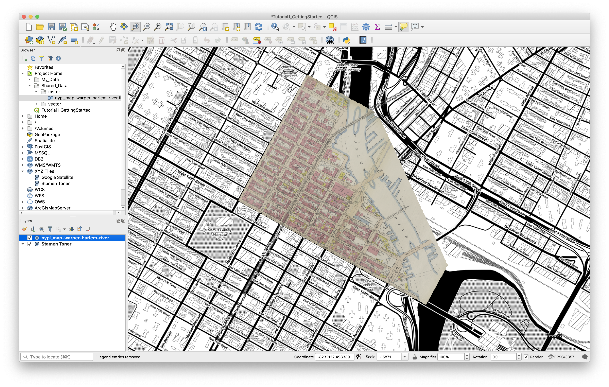

Notice that when we change zoom levels this layer stays the same. Each cell in the raster grid corresponds to the same geographic region (about 1 square foot) regardless of zoom level.

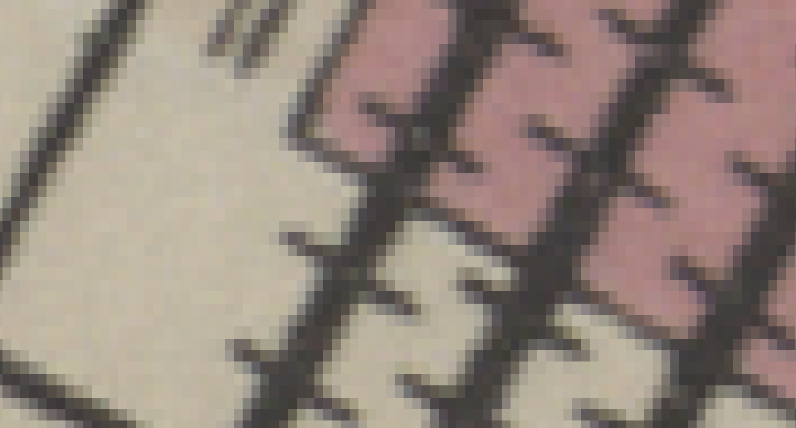

### Vector Layers from Shapefiles

There are several ways to add data to a map project. We will begin by using the "Add Vector Layer" button located on the Manage Layers Toolbar. If this toolbar is not present, remember you can access it by clicking through "View > Toolbars > Manage Layers Toolbar" from the main menu. (In the screenshot below, the Add Vector Layer button is the first.) Hover your cursor over each option to note their range.

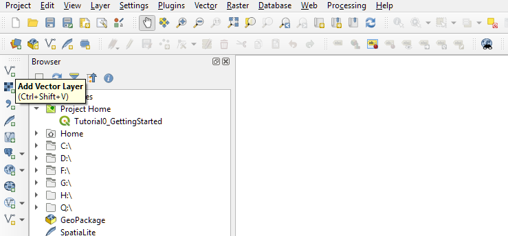

**Click** the Add Vector Layer button to open the Data Source Manager dialogue box and access the Vector options. There, you can **navigate** to the `Tutorial0_ClassData/Shape/` folder, which contains the vector shapefile layer we will use for this project, by clicking the Browse `...` button highlighted in red below. (Alternatively, you an always use the Browse option to navigate through your files.)

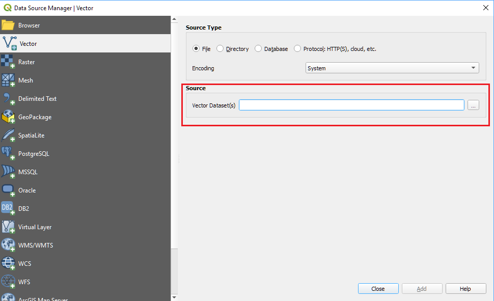

There are a number of different file extensions here that may be unfamiliar. Shapefiles are collections are separate files that describe different information or perform specific roles. The primary component files are as follows:

- .shp - The main file that stores the feature geometry (required).
- .shx - The index file that stores the index of the feature geometry (required).
- .dbf - The dBASE table that stores the attribute information of features (required).
- .sbn and .sbx - The files that store the spatial index of features.
- .prj - The file that stores the coordinate system information.
- For more information on these extensions and others see [this explanation by ESRI](http://webhelp.esri.com/arcgisdesktop/9.2/index.cfm?TopicName=Shapefile_file_extensions).

The files associated with a shapefile must stay together in the same folder, otherwise QGIS will not be able to load the layer (for the required files) or may not read it properly.

We will add the admin_0_countries shapefile (`admin_0_countries.shp`). Select the file and click Open.

Confirm that the appropriate file is named in the Vector Dataset(s) path in the Data Source Manager dialogue box and **click Add.**

The Coordinate Reference System Selector dialogue box will appear asking that you confirm (or specify) the coordinate system of the dataset you are adding to your map project. This layer is projected with the Mollweide *projection* based on the World Geodetic System of 1984 (WGS1984) *datum*. Read through the information in the dialogue box confirming this.

**Click OK** in the Coordinate Reference System Selector dialogue box to add the layer to your map project.

**Click Close** in the Data Source Manager dialogue box to exit it.

The layer should appear in your map project as shown below. Note that the colors associated with each polygon feature (in this case depicting national boundaries) is the same for all features in the layer, and the color assigned is arbitrary.

**Save** your map project.

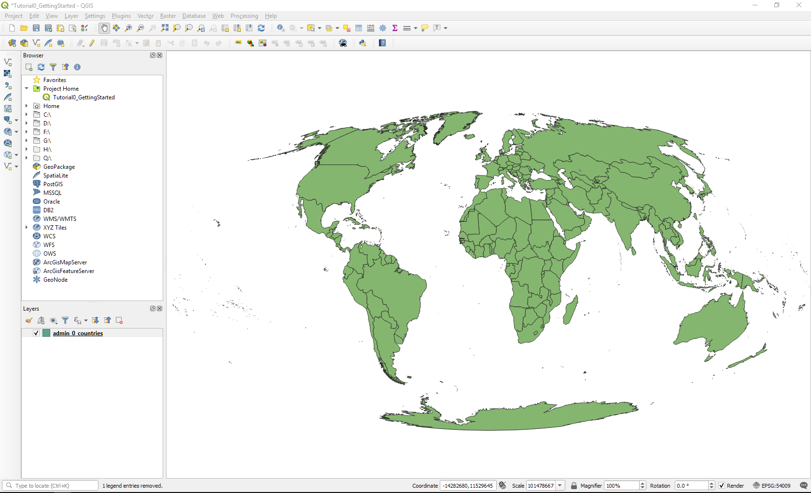

The layer name appears listed in the Layers Panel, along with a swatch of its symbol. You can **toggle** layers on and off by clicking the check-mark next to their name, allowing you to choose which are visible when multiple layers are added to a project. Further, you can arrange the order in which the layers are rendered by reordering the list (simply click and drag to reorder).

### Vector Layers from GeoJSON

Once you're done adding data, it's probably a good idea to save your project.

## Viewing Attributes

### Open the Attribute Table

To access the *Attribute Table* of associated with a vector feature class (and thus inspect the attributes of each feature), **right-click** on the layer name in the Layers panel and **select** Open Attribute Table.

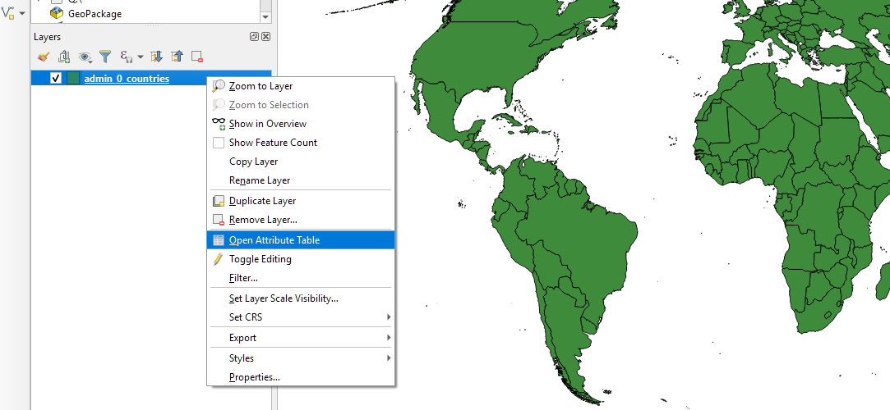

The layer's Attribute Table will appear, allowing you to inspect the information contained in the shapefile per feature. In the case of this basic administrative boundary layer, it contains information commonly used to identify countries. In the screenshot below, the table is sorted by the Name *field* (click on the field *header* to sort). The first feature is *selected* (click on the row label -- in this case, "1"). The corresponding polygon feature is also selected within the map project's *data frame*.

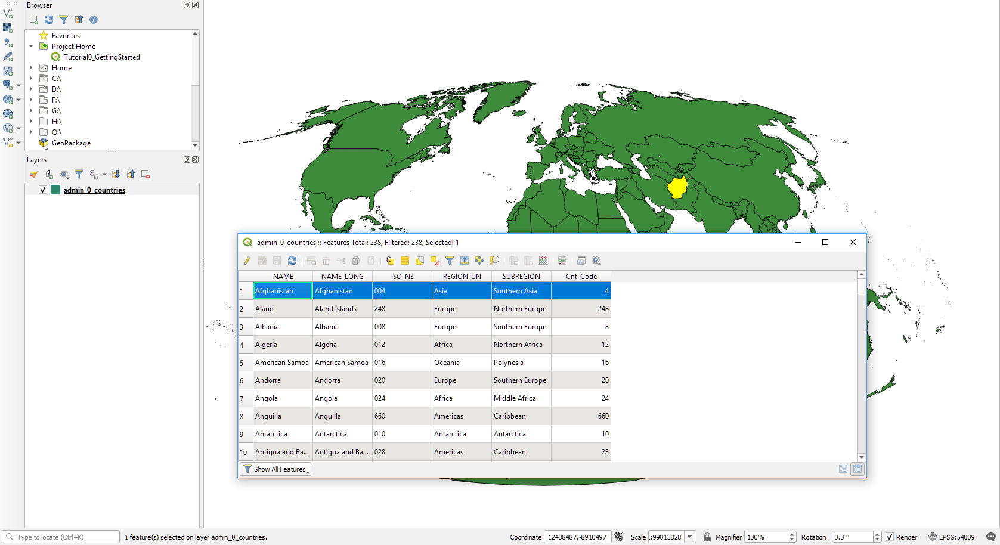

The attributes of this country-level dataset include the short and long-form names of each country in two separate *text* or *string* fields. Two additional text fields describe the global region and subregions (here, determined by the UN) to which each country belongs. Lastly, there are two separate fields denoting the ISO three-digit country code. The ISO_N3 field indeed includes three digits (with placeholder zeros where needed) and the Cnt_Code field does not. In this case, the ISO_N3 field contains text and the Cnt_Code field is numeric. Thus, while the ISO_N3 field appears to contain numeric information, the software does not interpret it as such and would be unable to perform mathematical operations on that field. (Remember that all information contained within a field is of a single data type.)

To **deselect** any selected features, click the Deselect All button on the Attribute Table's toolbar (or on the Attributes Toolbar).

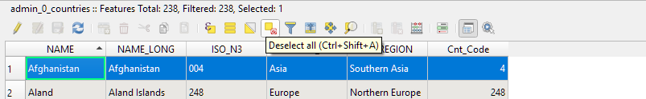

#### On your own: Interactively Selecting and Inspecting Features and Attributes

Interactively select features in the Attribute Table to highlight the corresponding polygon in the data frame.

Of course, the relationship between the geometry and attributes of a feature works in the opposite direction as well. Using the Selection Tool from the Attributes Toolbar (chosen in the screenshot below), you can also interactively select polygons and highlight them in the Attribute Table. Further, you can isolate selected features from the table: choose Show Selected Features from the the Attribute Table's filter drop-down menu.

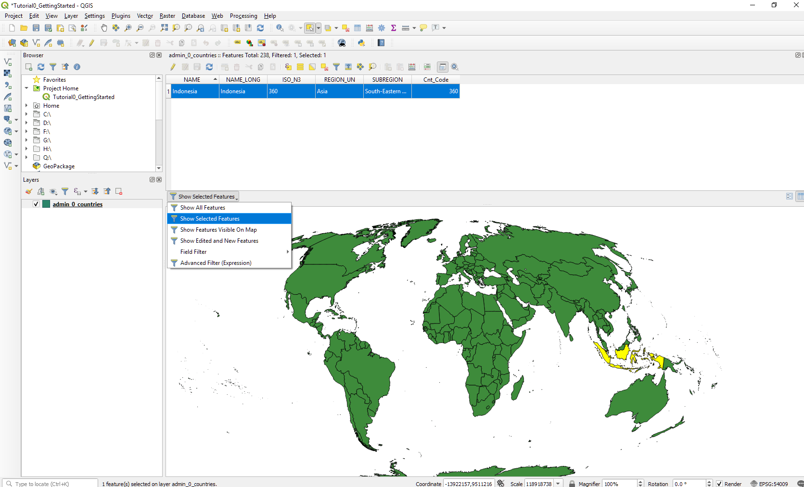

Notice in the screenshot above that Indonesia is selected. From the Attribute Table we can see that the many polygons representing the area of Indonesia collectively represent only one feature in the dataset. This is an example of a *multipart polygon*.

While exploring, you can zoom and pan across the map's data frame with the tools included in the Map Navigation Toolbar (below) or by scrolling (to zoom) and holding (to pan) your middle mouse button.

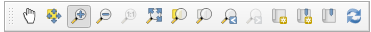

**Deselect** any selected features. Return your map to its full extents by **clicking the Zoom Full button**. **Save** your QGIS map project.

## Changing the Appearance of Data (Symbology)

We will discuss map *symbology* and cartography more completely later in the workshop, but for now, we will learn to make a few simple changes to the appearance of the national boundaries layer. First, we will change the default *symbol* used to visualize the data layer. Second, we will assign colors to each polygon based on a qualitative field in its attribute table (in this case, the subregion designation).

There are a few short-cut options in the QGIS interface for quickly changing a layer's symbols. We will walk through the Layer Properties dialogue box, which includes these and many more options and functions per layer.

#### Accessing Symbology Properties

To access the Layer Properties dialogue box, **right-click** on the layer name (`admin_0_countries`) in the Layers Panel and choose **Properties**.

From the lelf-hand menu, choose the **Symbology** menu. You should notice that the layer is currently symbolized with a "Single Symbol" system and a "simple fill." **Highlight** "Simple Fill" from the panel at the top of the dialogue box to access the symbol options.

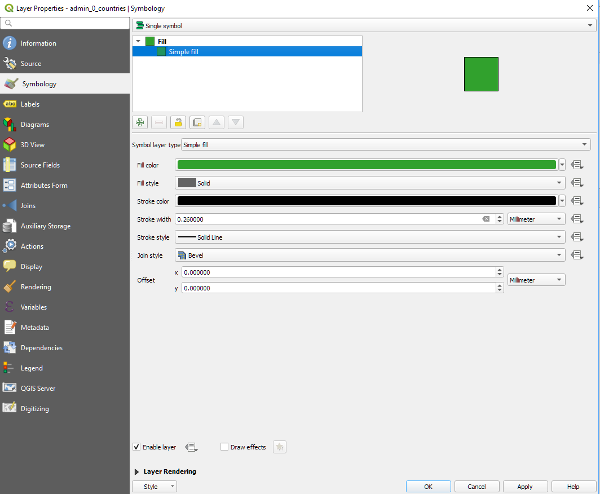

#### Changing a Single Symbol
Take a moment to read through the various options and to experiment with an alternative symbol. **Note** that these options are tailored to a polygon feature class. (Polyline layers, for example, would not have "fill" options.) You can specify the color and style of the polygon fill and the color and width of the polygon stroke (outline).

**Click** Apply to apply your changes. When you are satisfied with your decisions, **click** OK to save them and close the Properties dialogue box. In the example below, the features have a transparent fill and a heavy, red stroke.

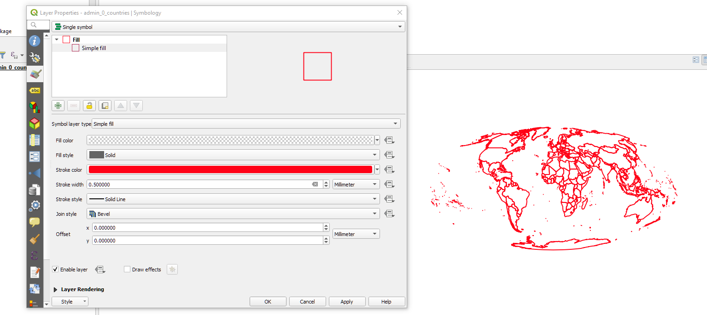

#### Qualitative or Categorical Symbology
We can also use the layer's attributes to organize or categorize the map's symbology. To do this, access the Layer Properties (Symbology menu) dialogue box again and specify **Categorized** symbols from the drop-down menu at the top of the dialogue.

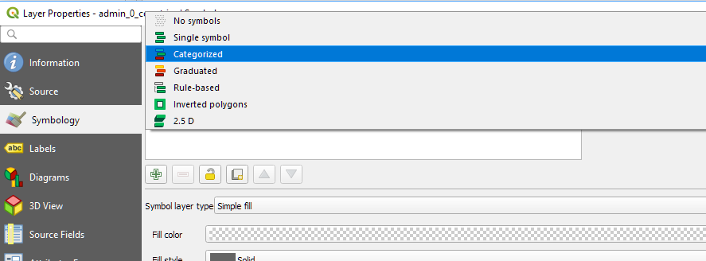

The symbology options will change, and from here we can quickly assign separate symbols to each feature within unique groups described in the Attribute Table. In this case, we will effectively color-code our polygons based on their subregion.

1. From the Column drop-down menu, **select** the SUBREGION field. **Note** that this menu includes each of the different fields included in the layer's attribute table.
2. **Confirm** that the Color Ramp option is set to Random Colors. (If it is not, you can select it by clicking the drop-down menu.)
3. Next, **click** the Classify button toward the bottom of the dialogue box to populate the panel with each unique value from the SUBREGION field. The Symbol list should automatically include each of the subregions listed in our dataset, with unique (randomly generated) color values.
4. **Click Apply** to apply your symbology changes.

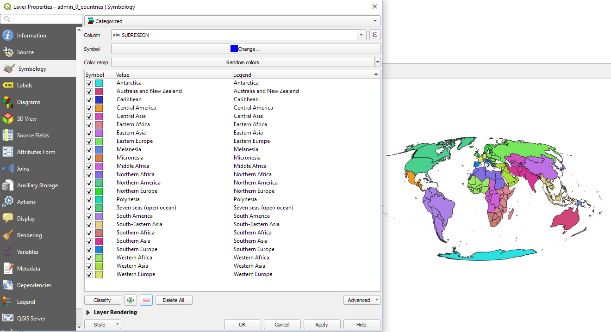

**Note** some of the options here. Each of the category symbols can be individually altered by double-clicking the color symbol swatch in the list. Categories can be toggled on or off (rendering features with those attribute values visible/invisible) or removed from the list altogether.

When you are satisfied with your categorical symbology strategy, **click OK** to exit the Layer Properties dialogue box.

**Save** your QGIS project.

---

Tutorial adapted from materials from [Mapping for the Urban Humanities](https://github.com/CenterForSpatialResearch/mapping_for_the_urban_humanities), taught by Bernadette Baird-Zars, Eric Glass & Leah Meisterlin in Summer 2019.
