## Objectives

This tutorial is meant to introduce QGIS as a tool for working with spatial data on your own computer. First we'll review the interface. Next you'll learn to create a project and add data from a variety of sources. Finally, we'll go over how to view **features** and **attributes** of the data you added, and control the appearance of data on the map.

## Setup

Before starting, you'll need to download and install QGIS. While the tutorials use version 3.4, you're welcome to experiment with any other 3.* version. Just be aware that your interface may not look exactly the same as the tutorial screenshots.

Since this series of tutorials is set up as a set of exercises around a common collection of data and culminating in a final project, you'll want to set up a **project folder** before getting started. All members of the Columbia community have access to unlimited storage on Google Drive, if you don't already do so, we recommend you use make use of this resource to back up your project folder through the [Backup and Sync](https://www.google.com/drive/download/backup-and-sync/) tool provided by Google.

Once your project folder is set up and syncing, go to the [Methods in Spatial Research](https://drive.google.com/drive/folders/1IVjKSGSpNVmGB6r6zkiWuKoeryMfxZow?usp=sharing) folder in your browser. Click the folder labeled "Shared Data" to select it, and press `Shift + Z`. In the pop-up window, navigate to your project folder and then click "Add". This will create an instance of the shared data folder for the class within your project that will automatically keep itself updated if the data should change. In your project folder, also create a folder labeled "My_Data". This is where you'll store datasets you create yourself in Weeks 3 and 4.

## The QGIS Interface

When you first launch QGIS, it opens a new blank map project as illustrated in the screenshot above. The following list outlines the most important interface elements:

1. The **Menu Bar** is a standard menu bar that gives you access to most of the software's functionality. On a Mac this will be at the top of your screen; on Windows it's attached to the top of the QGIS window itself. Note that many of the items you can access here can also be accessed through the icons on the toolbars below.
2. **Toolbars** give access to many commonly used tools and features in QGIS, grouped by function. To open additional toolbars (or reopen them if they are accidentally closed), right-click in the space around an existing toolbar and select one from the list that appears.
3. The **Map View** is where your data will appear, according to the settings defined in each layer.
4. The **Layer Panel** shows all of the data layers you have added to your current map project. The order of the layers in this menu determines the overlapping order in which the layers appear in the map view (higher items on the list appear on top). The check boxes next to each layer name allows you to turn the visibility of layers on and off. You can also access properties for that layer and perform operations on it by right-clicking the layer name. This is sometimes also referred to as the Map Legend or the Table of Contents.
5. The **Browser Panel** contains a list of data sources on your computer's file system (represented by folder icons) and various network sources (each has a different blue-hued icon). Folders and other sources can be expanded by clicking the triangles to the left of each icon. Anything here that can be read by QGIS as a layer can be added to the project by dragging it to the Layer Panel or Map View.
6. Finally, the **Status Bar** shows the position of your cursor in the map view, the current scale and rotation of the map view, and the project’s coordinate system. When working with large datasets, you can also pause/resume map drawing with the "Render" checkbox.

Hovering over any button in the interface will display a **tooltip** with a brief description. More details can be found in the [QGIS Documentation](https://docs.qgis.org/3.4/en/docs/user_manual/introduction/qgis_gui.html).

Once you're familiar with the standard interface layout, you may want to customize your workspace. Toolbars and Panels can be turned on or off by right-clicking blank space next to existing toolbars (see above) or through the menu bar under View > Toolbars or View > Panels. They can also be repositioned by clicking and dragging anywhere in the panel frame or from the handle to the left of each toolbar. Each element can be either docked (snappable areas will be highlighted in blue as you drag around the window) or undocked/freely positioned. If you ever need to reset the interface to its default settings, you can do so under Preferences > System > Settings > Reset user interface to default settings.

## Creating and Accessing Projects

Before beginning a new project, **Save** your (empty) tutorial file in the project folder you set up earlier. Like most programs, QGIS lets you save either with Ctrl-S, a toolbar button (look for the blue floppy disk) or through the Menu Bar (Project > Save). Name the file `Tutorial1_GettingStarted`. The `.qgz` extension for QGIS files will be added to your filename automatically.

Quit and relaunch QGIS. This time, instead of a new empty project you should see a list of Recent Projects in the Map View. Double-click to reopen your tutorial file. Notice that your project folder has now been added to to the Brower Panel, shown with a green folder icon as "Project Home". If you expand the folder, you should see your "My_Data" and "Shared_Data" folders along with your tutorial file.

## Adding Data

Now we're ready to add some data to our project.

QGIS provides powerful tools for manipulating and rendering spatial data but **the program itself does not handle data storage**. Instead, when you add data to a map in QGIS, it creates a new **layer** containing a link to wherever the data is actually stored. Every time the program needs to draw, look up, or write data associated with that layer, it accesses it through the link. This has many benefits:

- You can produce multiple maps using the same data
- The data can be updated or revised independently of the map
- Using a network, multiple mapmakers can share a pool of data resources

At the same time, this approach also requires the mapmaker to think strategically (or even spatially) about where your data is coming from.

When creating your own data and storing it locally, extra care is needed to make sure this linked approach is successful. First, maintaining **clear and consistent file organization is extremely important**. Once a link is established, moving, reorganizing or renaming files will require you to re-link each one. Second, **spaces or unusual characters within the file path can cause errors** in some spatial analysis software. Because of this it is recommended that you limit all file and folder names to letters, digits and underscores.

In the next few sections we'll look at a couple of different ways to add data to your map.

### Raster Tiles (XYZ, WMTS and others)

When starting a new mapping project, getting a sense of context and orientation is often important. A set of **map tiles**, made available through a web server, can provide coverage of the earth's entire surface at varying levels of detail required by different zoom levels. This technique is behind most online map services but can also be used within QGIS alongside other forms of data. Here we'll make a connection to [Stamen Design](http://maps.stamen.com/#toner/)'s *Toner* tileset (generated from [OpenStreetMap](https://en.wikipedia.org/wiki/OpenStreetMap) Data) and add it to our map.

In the Browser Panel, right-click "XYZ Tiles" and select "New Connection". Give your new connection a name like "Stamen Toner", and paste the following URL into the URL field:

`http://a.tile.stamen.com/toner/{z}/{x}/{y}.png`

Now you should see an entry for Stamen Toner appear under XYZ Tiles when expanded. Click and drag this service into your Layers Panel or Map View and you'll see something like the image below. Notice how the map redraws at specific zoom levels, revealing or removing detail.

The data we get from the tileserver is **raster data**. This means the area shown in our map is continuously covered with an even grid of pixel-like **cells**, each one enclosing a discrete unit of geographic space. Each raster cell in the Toner tile set is colored either black or white. Try changing the zoom level of the map using the scroll wheel on your mouse or using the tools in the Zoom toolbar. As we jump between zoom levels, the tile server sends down new raster tiles with varying spatial resolutions; when we zoom in, each cell represents a smaller and smaller portion of the territory.

### Raster Layers from TIFF

Another way to add raster data is from a single .tif file stored locally. We'll use a scanned map that was **georectified** through the New York Public Library's Map Warper program. We'll talk more about what that means in Week 4, for now it's important to know that another mapmaker has assigned a specific geographic location and other properties to the scanned image to ensure conformity with the digital model of geographic space used inside the QGIS environment.

To add the file to your map, navigate to `Project Home/Shared_Data/raster` in the Browser Panel and drag `nypl_map-warper-harlem-river.tif` into your layers panel. Notice that the icon to the left of the file is the same as our tile service layer, indicating both are raster.

Right-click the newly added layer and select "Zoom to Layer". This will show the TIFF file superimposed on our base map.

Notice that when we change zoom levels this layer stays the same. Each cell in the raster grid corresponds to the same geographic region (about 1 square foot) regardless of zoom level.

Try turning a layer off and on again using the checkboxes in the Layers Panel.

### Vector Layers from Shapefiles

**Vector data** is another common way to represent spatial data. Instead of a continuous field of cells, vector data describes specific **features** using points, lines and polygons. If raster data can be said to describe the ground (in an abstract sense), vector data describes the figures or objects that sit within it.

In your file browser (Finder, if you're on a Mac; File Explorer on Windows), navigate to `Shared_Data/Vector/nyc_harlemriverstreettrees` within your project folder. Inside you'll find six files with the same name but different extensions.

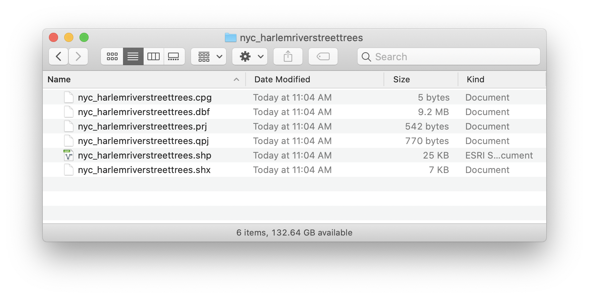

In the ESRI Shapefile format, one way of storing vector data, this collection of files is referred to (confusingly) as a shapefile. While it's enclosed within a folder here for clarity and convenience, this will not always be the case. However, all parts of the shapefile must be stored within the same folder to function properly. The different files we see here each play different roles in describing the data, as outlined below:

- **.shp** stores the feature geometry itself and is always required.
- **.dbf** stores the attribute information of features (also required).
- **.prj** - The file that stores the coordinate system information.
- **.shx** stores the index of the feature geometry (required).
- **.sbn** and **.sbx** store the spatial index of features.
- For more information on these extensions and others see [this explanation by ESRI](http://webhelp.esri.com/arcgisdesktop/9.2/index.cfm?TopicName=Shapefile_file_extensions).

If you navigate to this same location in the QGIS Browser Panel, you'll see that it displays only one item of the six, with a blue blob icon to the left indicating it is a vector data file.

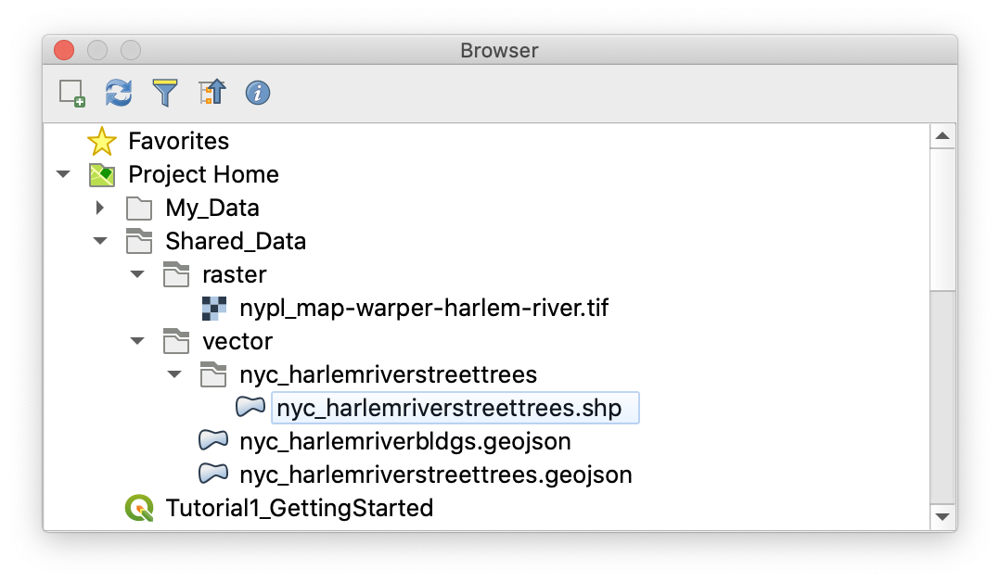

To add a vector layer to your project, simply drag the displayed shapefile into your Layers Panel or Map View. Let's add this shapefile (of street trees in our project area, obtained from the 2015 NYC Street Tree Census) to the map. You can also use Layer > Add Layer > Add Vector Layer on the Menu Bar, or the Add Vector Layer button in the Manage Layers Toolbar (not visible by default). You should now see three layers in your project:

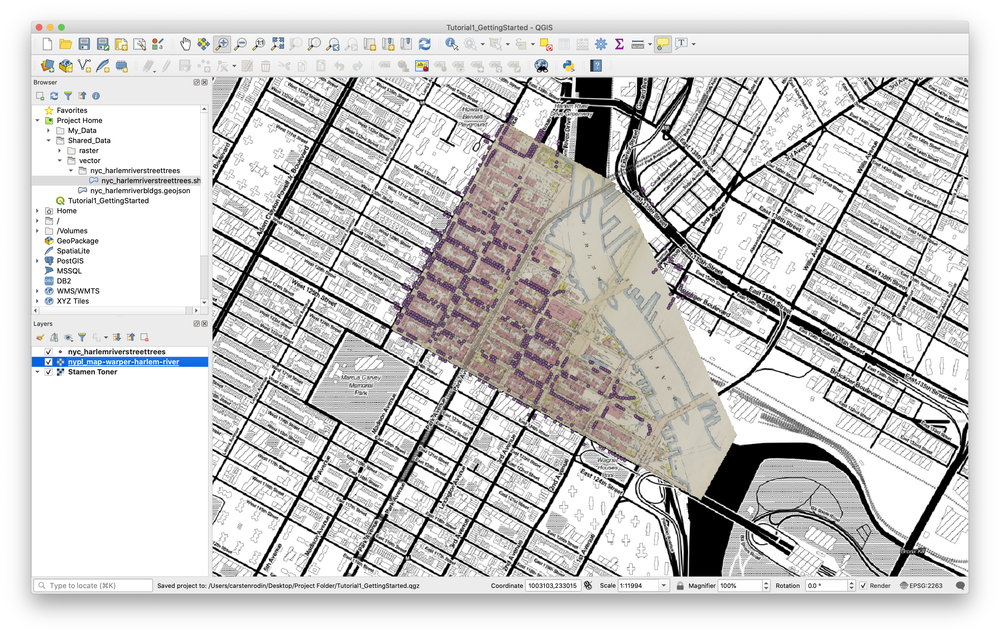

Try reordering your layers in the Layers Panel by dragging the street trees layer up or down the list and then put them back in order.

### Vector Layers from GeoJSON

If you find yourself thinking shapefiles seem too complicated and messy, you're not alone! As more and more spatial data has been published and shared online, people have recognized the need for a more portable format for vector data. [GeoJSON](https://en.wikipedia.org/wiki/GeoJSON) is a standard format for spatial data defined and administered by a community of users. Its main advantage over the shapefile is that it encodes geometry, attributes, indexes, projections, metadata and more **within a single file**. In practice, GeoJSON and Shapefiles are interchangeable, but GeoJSON is much easier to manage because the user has only one file per layer to worry about. Adding a vector layer from GeoJSON works the same way, just drag the file into your Layer Panel or Map View from the Browser or another location on your computer. Try it with the `nyc_harlemriverbldgs.geojson` file under `Shared_Data/vector`.

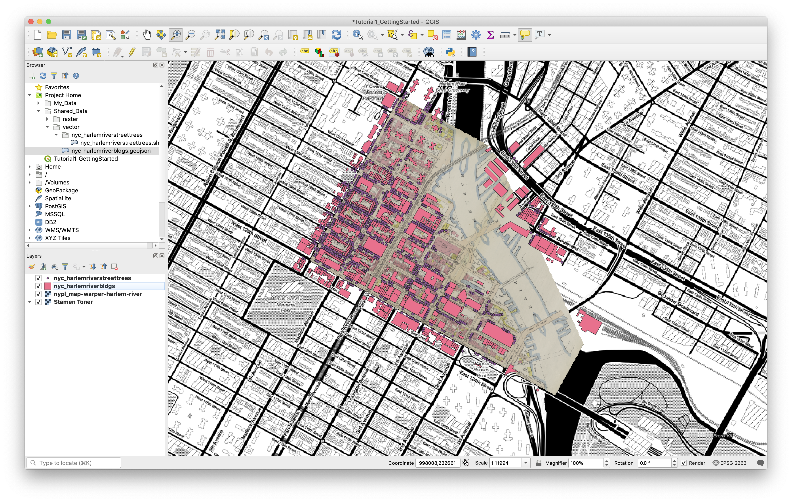

In the "Rotation" field in the Status Bar (bottom of the screen), enter "-28.7" to set your view to match the orientation of the Manhattan street grid. Pan and zoom your map so that the blocks between 125th and 128th Streets and Park and 5th Avenue are visible. You can Pan using the Pan tool in the Map Navigation Toolbar, or by clicking and dragging the scroll wheel on your mouse.

QGIS allows you to **bookmark** a region on your map for later reference by pressing Cmd-B on your keyboard, clicking the New Bookmark button on the Map Navigation Toolbar, or selecting View > New Bookmark from the Menu Bar. Create a bookmark for the map view you just set up. The Spatial Bookmarks Panel will automatically be added to the interface. To restore a bookmark, select it here and press Zoom to Bookmark at the top of the Panel.

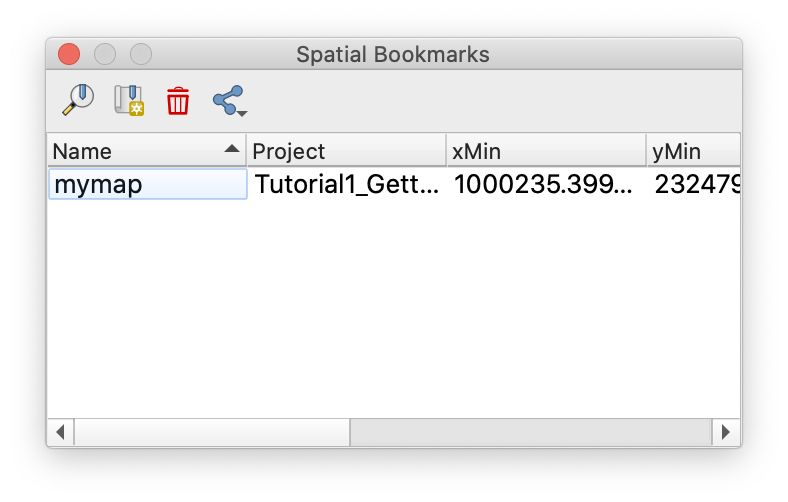

Now that all of your data has been added to the map, save the file.

## Viewing Attributes

An important advantage of vector data is that each feature can be associated with various attributes – qualitative or quantitative data describing the feature in question.

One way to see the attributes for a given feature is using the Identify Features tool at the left side of the the Attributes Toolbar.

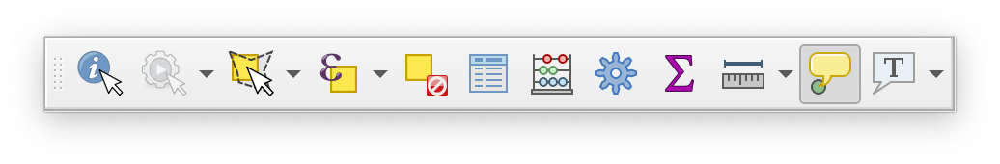

Turn off the two raster layers in your map. Click the street trees layer to select it. Then, with the Identify Features tool selected, click one of the points in the layer. The Identify Results Panel will appear with information about the point you've selected:

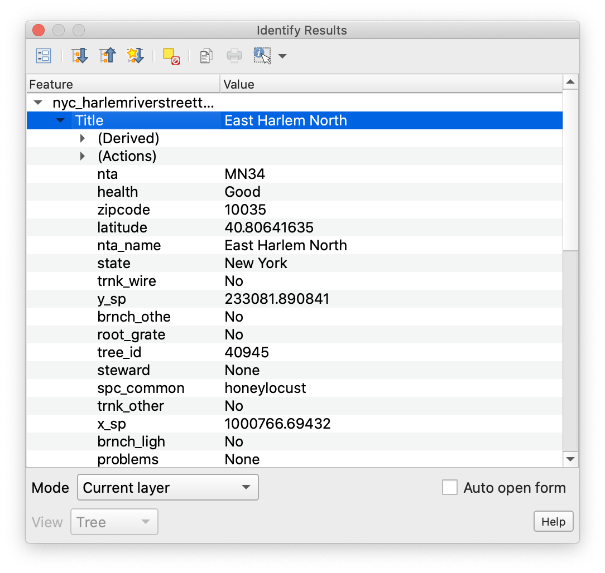

You'll see that this particular tree is a Honey Locust, in good health, and has been given assigned a `tree_id` of 40945. No problems!

If you want to see the attributes for multiple features at a time, you can use the **attribute table**. It can be accessed by right-clicking any vector layer, and picking "Open Attribute Table" from the menu. Let's try it with our building footprints layer:

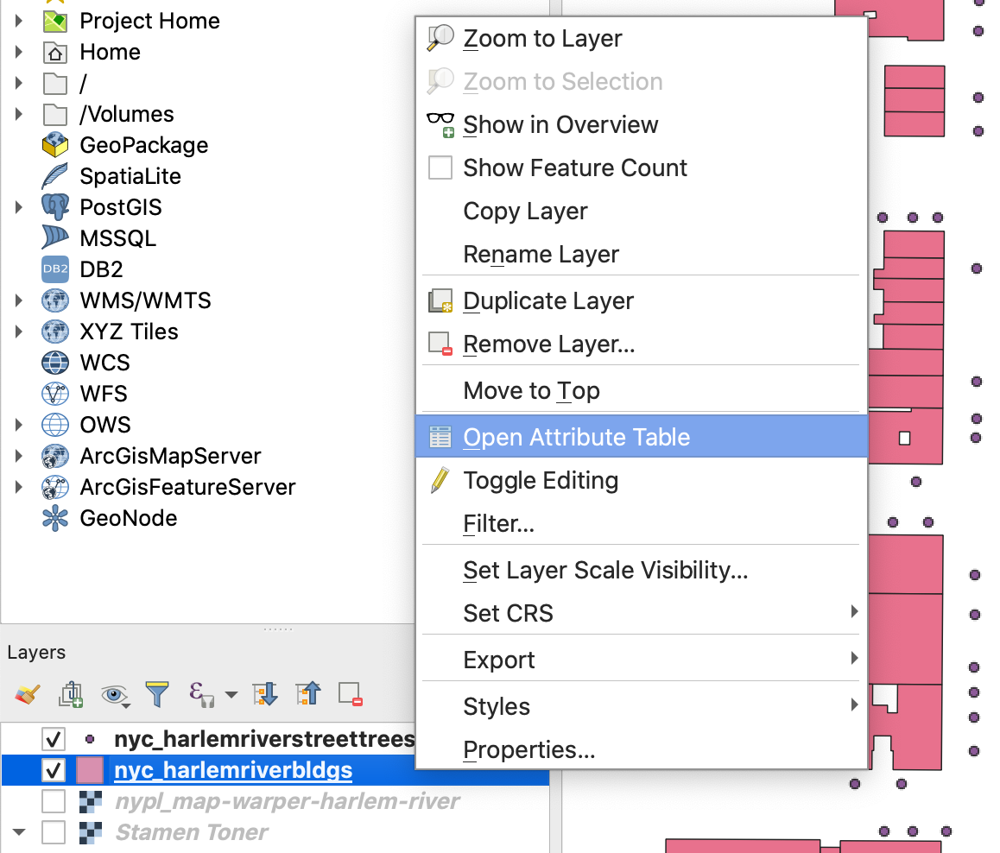

Inside the attribute table, you'll see a list of rows, each corresponding to a feature. **Fields** containing different types of attribute data are displayed as columns. Here, we have things like construction year, roof and ground heights, and geometry source. You can click any field name to sort features on that field. Clicking the row number will **select** a single feature, you can also select multiple features by holding cmd or shift while clicking. Features selected in the attribute table can be located in the map view by clicking the "Zoom the map to selected rows" button, located near the middle of the attribute table's toolbar. To reduce clutter in the interface, you can dock the attribute table by pressing the Dock Attribute Table button, second from the right in the same toolbar.

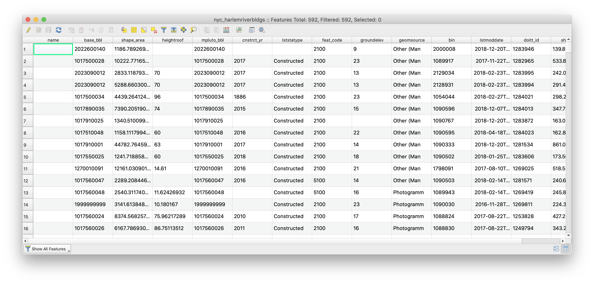

At any given time, the features selected in the attribute table and the map view will be the same. You can control the selection in the attribute table in addition to selecting features directly from the map, using the selection tools in the attributes toolbar. "Select features by area or single click", near the middle of the toolbar, is the default option. Use this to select some buildings on the map. At first, you may not see any changes reflected in the attribute table, but you can use the "Move Selection to Top" button in the attribute table toolbar to make sure selected features are always shown in the top rows of the table.

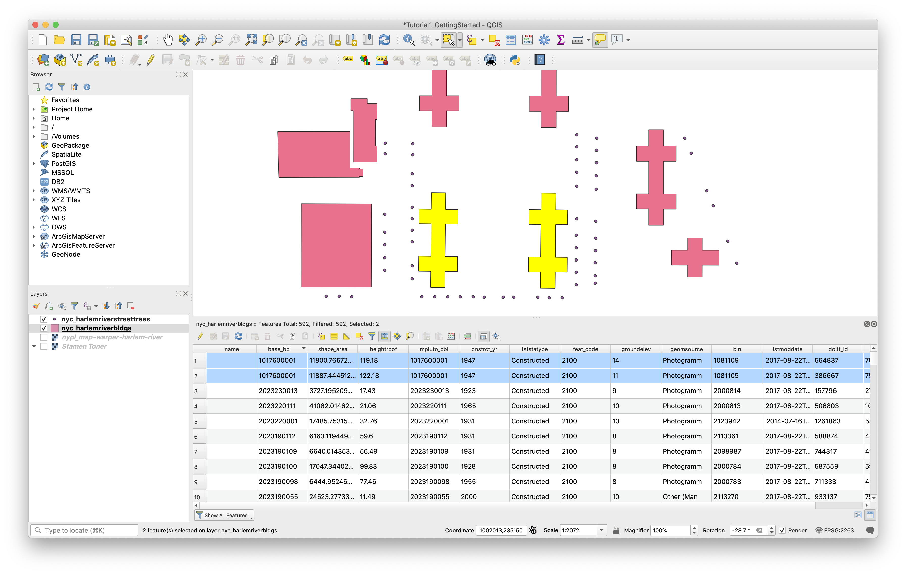

**Deselect** any selected features using the " button (either in the attributes toolbar or the attribute table toolbar). Use your bookmark to restore your earlier view, turn on the two raster layers again, and close the attribute table.

## Changing the Appearance of Data in the Map

We'll discuss map symbology in more detail later in the workshop, but for now, we'll walk through a few simple changes to the appearance of the four layers in your map. First, we will change the default symbol used to visualize the street trees layer. Second, we'll will assign colors to each building polygon based on a field in its attribute table. Finally we'll learn to change layer transparency settings to better show relationships between layers through superimposition.

In QGIS, the appearance of each layer is controlled through the Layer Properties dialogue box, which you can access by right-clicking on the layer name in the Layers Panel and selecting "Properties".

### Changing a Single Symbol

First, let's change the appearance of our street trees layer. Access the Layer Properties and then click the "Symbology" tab.

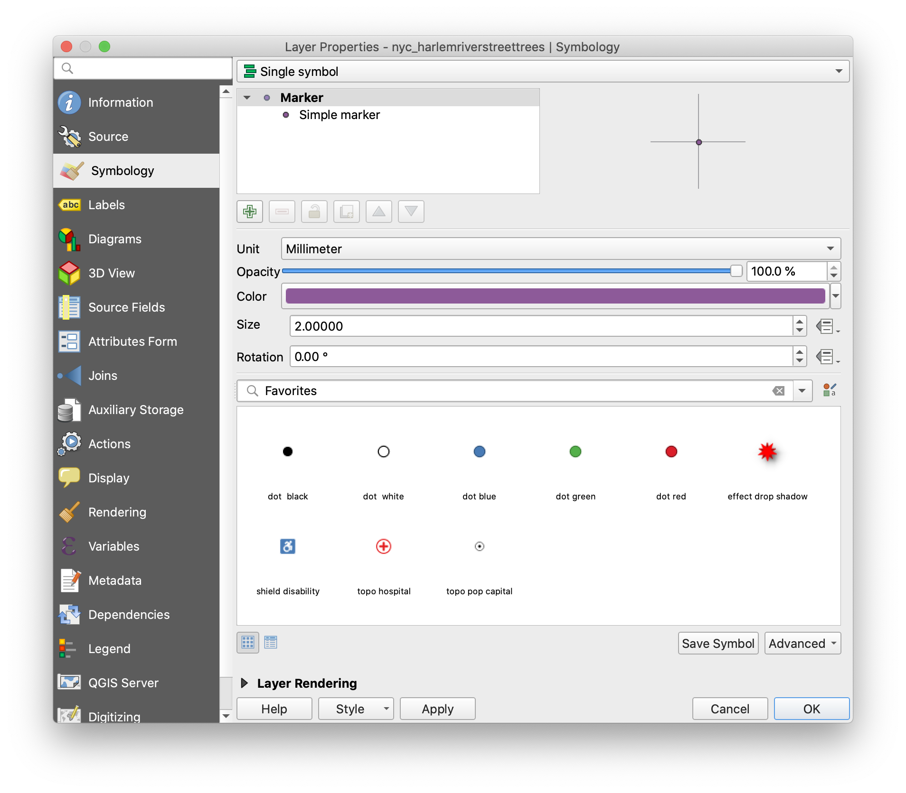

You'll see a few readymade symbol options displayed under "Favorites". Try changing the symbol to "dot green" and click Apply to see changes.

All of the symbol display parameters can also be controlled individually, and further options can be found if you click "Simple Marker" under Marker in the symbol outline toward the top of the window. Experiment with the options for each one.

Set "Stroke Style" to "No Pen", change the units drop-down in the Size row to "Map Units", then click the button at the right side of the Size row and click "Edit" under Expression. Enter `("tree_dbh"/2)+10` in the Expression String Builder and click OK. Notice that the tree points are now displayed with variable size defined by the trunk diameter field.

Once you're satisfied with the appearance of your layer, click OK.

### Qualitative or Categorical Symbology

Next let's look at how to use attributes to control the color of different features. Remember that our building footprint dataset contains a construction year for each building. If we want to be able to distinguish new buildings from old ones on our map, we can use color.

Again, access the Symbology tab under layer properties for the builing footprints layer. This time, since the data is polygons instead of points, we have different options in the drop-down at the top of the window. Choose "Graduated".

Next, click the Expression button at the right-hand side of the "Column" row and enter ` to_int(  "cnstrct_yr" )` in the editor. Click OK. Normally we would be able to just choose construction year from the Column drop-down, but in this particular dataset the data is formatted as text rather than a number so it must be converted with an expression.

Next, click the color ramp. By default it will run from white to red, but we want to change "Color 1" in the window that pops up to blue. Click OK to save your color ramp.

QGIS can automatically generate a range of colors to use in the layer display, but here we want to set them manually. Change "Classes" to 4, then click Classify. You'll see the list of classes update with auto-generated values, but we can override these with our own numbers. Double-click in the "Values" column for the first symbol, and set the range from 0 to 1960. Set the second one to 1960 to 1980, the third from 1980 to 2000 and the last one to 2000 to 2020. You'll notice that the lower value automatically updates to reflect the entry for the previous class. Click Apply.

Finally, expand the "Layer Rendering" options at the bottom of the window. Set Opacity to ~70%. Click OK. The age of buildings on the map is now visualized, and the transparency allows us to compare the present-day building layer with the historical map.

Finally, let's give some transparency to the NYPL raster layer as well so it can be compared with the present-day map tiles layer. For raster data, this is set under Layer Properties > Symbology.

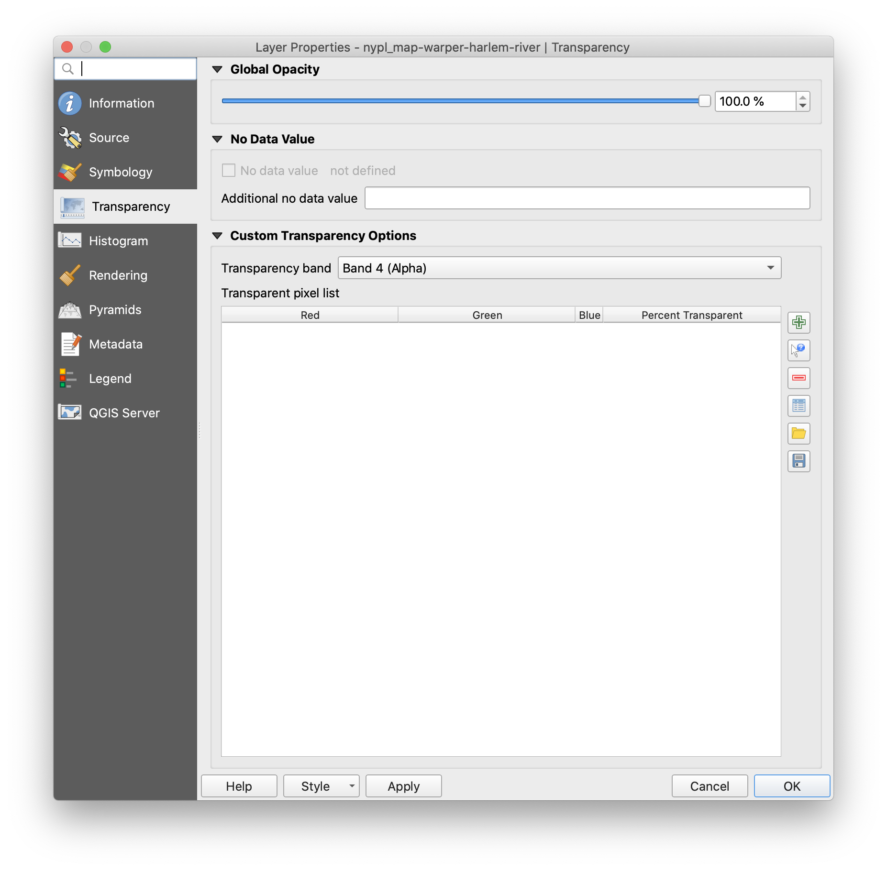

Pan around the map to find some places where the present-day map layers differ from the historic map.

Remember to **Save** your QGIS project before closing.

---

Tutorial by Carsten Rodin, Spring 2020.

Adapted from materials from [Mapping for the Urban Humanities](https://github.com/CenterForSpatialResearch/mapping_for_the_urban_humanities), taught by Bernadette Baird-Zars, Eric Glass & Leah Meisterlin, Summer 2019.
