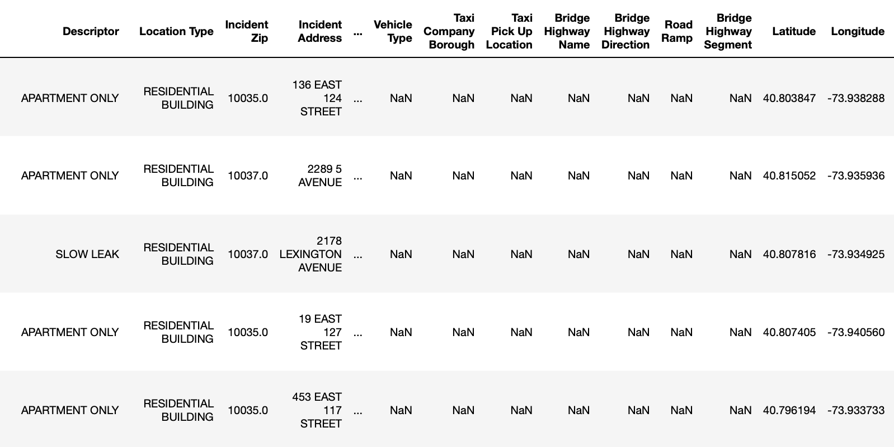
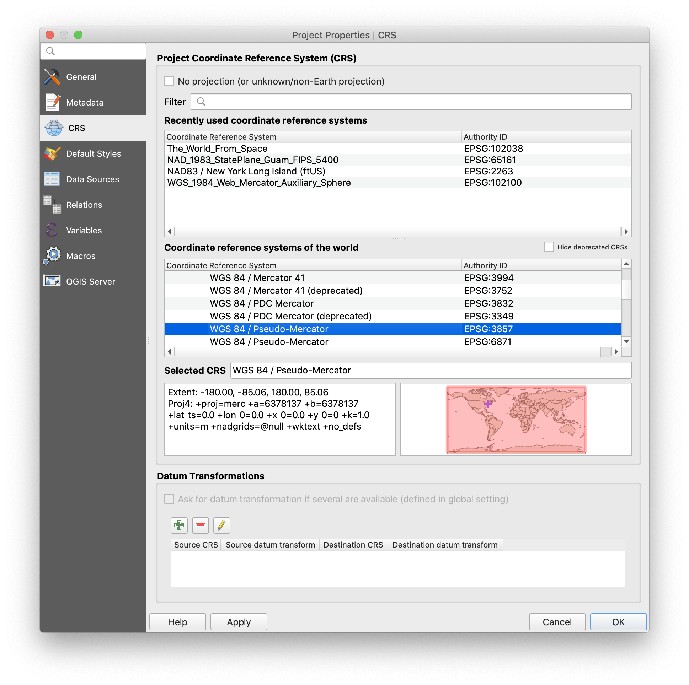
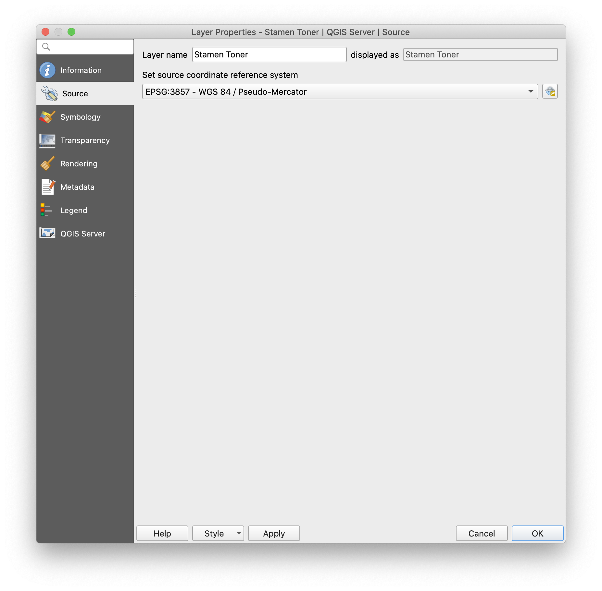
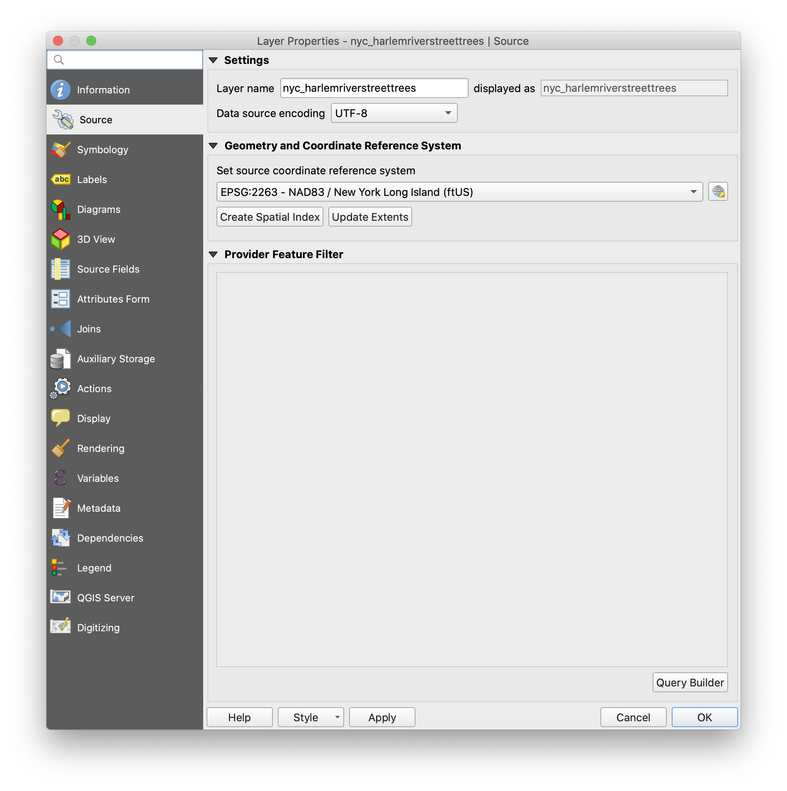
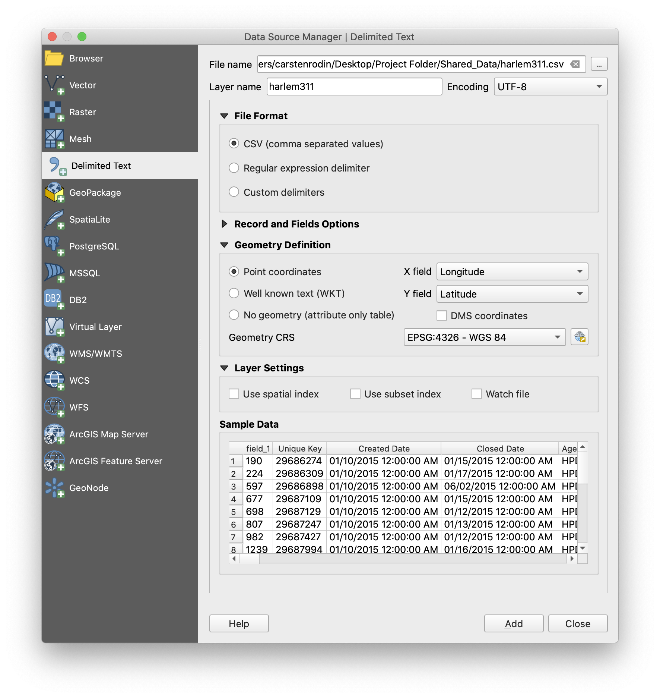
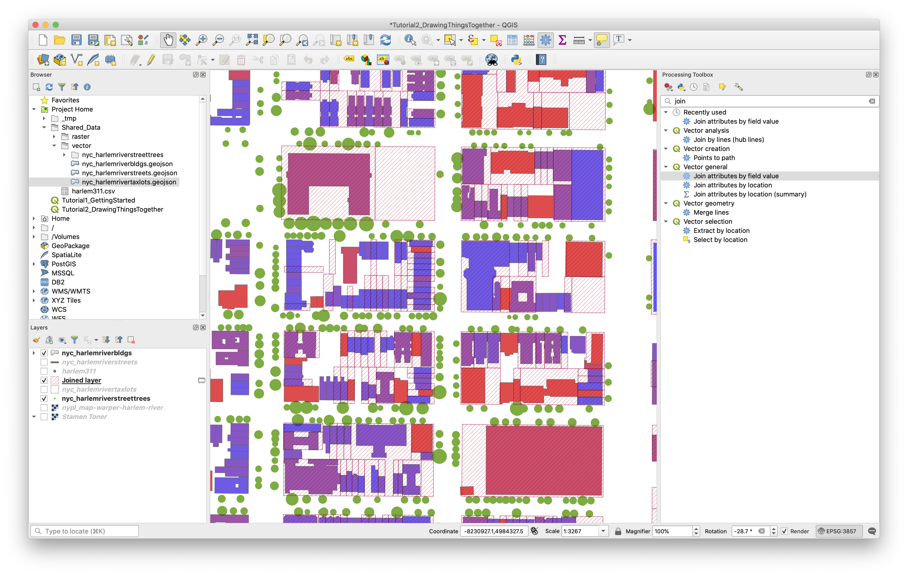
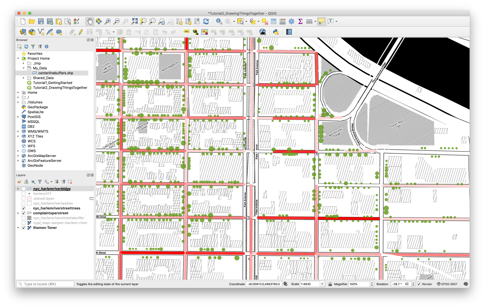
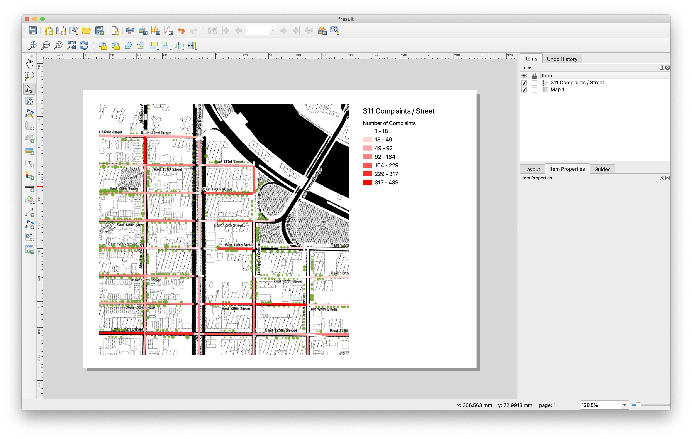

## Objectives

This tutorial will continue our introduction to QGIS and introduce specific methods for 'drawing together' different datasets within our map environment. We'll first cover how to import a list of points and associated attributes from a .csv file. In doing this, we'll review how **projections** are handled in QGIS, and specifically how to reproject data into a consistent **coordinate reference system** across your project. We'll then review two methods for making connections across datasets - the **table join** and **spatial join**. Finally, you'll learn to use the **print layout** feature to annotate and export maps as PDFs and images.

To get started, open `Tutorial1_GettingStarted` and use "Save As" to create a new copy named `Tutorial2_DrawingThingsTogether`.

## Adding Data from a CSV

In the last tutorial, we looked at how to bring different kinds of data into our map environment and how to explore their interrelationships visually. Here we'll attempt to expand on our understanding of how the software handles the translation of data into a common framework using projections. A good way to illustrate this is by spatializing an existing dataset from scratch.

In your Shared_Data folder you should see a new file since last time: `harlem311.csv`. This file contains complaints made to the city's 311 hotline between 2015 and 2016 around our study area from Tutorial 1. Each complaint has Latitude and Longitude coordinates assigned to it:

QGIS can draw this data on the map pretty easily, but it needs some extra information from us to do it properly. Remember from the last tutorial that ESRI shapefiles contain a `.prj` which defines the **projection** or **coordinate reference system** the dataset was created in, and that GeoJSON files also contain something similar. Even our `.tiff` raster file and the tile server connection we established also have a way of communicating to the software what projection is being used. As long as this information is provided, QGIS can automatically reconcile the different projections into a common spatial framework using what we call **reprojection on the fly**. Any time you import a new dataset into a blank map, the software will set the Project Coordinate Reference system to match the CRS of the data. New layers that get added are then automatically reprojected in the Map View to match the Project CRS.

### What's My Projection?

We can see this if we double-click the CRS label at the right side of the status bar - it should read `EPSG:3857`. In the Project Properties window that appears, we can see that EPSG:3857 is shorthand for "WGS 84 / Pseudo-Mercator", a common projection used by tile-served rasters.

If we right-click our "Stamen Toner" layer, which was the first layer in our project and navigate to the Source tab of the Layer Properties window, we'll see that the projection for this layer is the same.

Check the Harlem River Street Trees layer. This layer has a different projection - "NAD83 / New York Long Island (ftUS)" or EPSG:2263. When we're *viewing* data, this difference doesn't matter at all. The software translates the street trees geometry from EPSG:2263 to EPSG:3857 in the background before drawing it on the map and we don't need to worry.

When we start to *process* data, we (the users) need to control our use of projections more directly, including when we import points from a .csv table. Let's work on that now. Navigate to your Shared_Data folder in the Browser and locate the harlem311.csv file. Right-click it and select "Properties" to quickly review the Metadata and Attributes. Notice there will be no preview since we haven't specified yet how the software should assign geometry to the records in the table.

Choose Layer > Add Layer > Add Delimited Text Layer from the Menu Bar. Under "File Name" in the window that appears, navigate again to the 311 complaint file. You'll notice that much of the information in the dialog auto-fills at this point, including the text encoding, layer name and file format. **Important!** Make sure "Detect field types" under "Record and Fields options" is selected. If you expand the "Geometry Definition" portion of the panel, you'll see that "X field" and "Y field" are assigned to the Longitude and Latitude fields in the table. Sometimes you may need to specify these manually, so always double-check. Finally, under Geometry CRS, click the "Select CRS" button at the right-hand side of the panel and choose WGS 84 / EPSG:4326 from the menu. This is the standard CRS used for raw lat/lon coordinates. Click OK, Add, then Close and you'll see the complaints appear as point data in your map. Try applying your own point symbol in the Layer Properties > Symbology.

## Table Joins

One way we can start to see correspondences between datasets in our map environment is through a **join**. Joins use two vector layers – a **target layer** and a **join layer** – to create a new version of the target layer with additional attributes based on its relationship with the join layer.

In a **table join**, that relationship is defined by a common attribute field between the two layers. To see how this works, add the `nyc_harlemrivertaxlots` layer from Shared_Data/vector, taking a moment to adjust its appearance to suit your map. You may want to also turn off our two raster layers for clarity. We'll use the new tax lots layer as our target layer, and the 311 complaints as the join layer to see how many complaints there are per building in this area.

To create the join, open the Processing Toolbox using its toolbar button (it looks like a blue gear). In the panel's search bar, type "join" and you'll see a list of tools appear. Under "Vector general" double-click "Join attributes by field value" to launch the tool. Set Input Layer 1 to your target layer (tax lots) and select "bbl_num2" as its Table Field. Input Layer 2 will be your join layer (311 complaints), and you can set its Table Field to "BBL". We want to only reveal buildings (or tax lots, actually) where there have been at least one complaint, so set Join Type to one-to-one and check "Discard records which could not be joined". Make sure "Open output file after running algorithm" is checked and click "Run". You should see a new layer appear in your Layer Panel with the result. Adjust the layer symbology to help communicate this new information.

Note that the resulting layer is only temporary - if you close and reopen the program it will disappear. To make it permanent, right-click the layer, choose "Make Permanent" and use the dialog box to save it somewhere in your project folder. It will use the current layer settings (including projection) to save the file.

## Spatial Joins

A **spatial join** works in a similar way except the relationship between the two tables is defined spatially. Start by adding `nyc_harlemriverstreetsbuffer` layer from Shared_Data/vector - don't worry about changing symbology for now.

In the Procesing Toolbox, find "Join Attributes By Location (Summary)" in the list and launch the tool. Here we'll set the buffered streets layer as the Target ("Input Layer") and the 311 complaints as the Join Layer. Instead of field names, the tool asks us for a "Geometric Predicate" - this is just the spatial relationship we're going to look for in making the connection between the two datasets. Choose "intersects" for now. The tool will let you specify fields to summarize, and the method you want to use (e.g. average, sum etc. under "Summaries to calculate"). Leave both of these blank. Click Run.

Spatial joins are somewhat computationally intensive, so take a break while it runs. This might be a good time to read about the [Squirrel Census](https://www.thesquirrelcensus.com) if you haven't already.

Once you have your result, try to set up the layer symbology so that it reveals the number of complaints per street through graduated color.

It's important to note that when undertaking any spatial processing, including performing a spatial join, **all input layers are required to have the same projection**. Here the two input layers happen to be projected for youAn easy way to reproject a vector layer is to simply export it in a new projection. Right click the layer, choose Export > Save Features As... and choose the needed projection in the Save prompt. You can also use this feature to save subsets of data based on a selection if you check the "Save selected features only box.

When you are finished, **Save** your Layout and Map project.

## Exporting Your Map from the Print Layout

When you are satisfied with your symbology choices and are ready to export a map document from QGIS, you will need to create a New Print Layout. You can use the "New Print Layout" button on the Project Toolbar (to the right of "Save As") or the Menu Bar via Project > New Print Layout. Enter a title for your layout and click OK.

In QGIS, the Print Layout functionality is contained within a separate window from the main interface. Like the main window, you'll notice a Menu Bar, Status Bar, some Toolbars and Panels (on the right instead of the left). The biggest difference is that the Map View has been replaced by the **Layout View**, which is where you'll compose your different layout elements to create your finished map.

Here you can also use Tooltips to learn more about elements of the interface.

Use the "Add Map" button or Add Item > Add Map on the Menu Bar to add a map view to your layout. With the tool selected, click and drag over the part of the layout where you want the map to appear. Notice that the appearance of the map, including layer visibility and symbology options, have the same appearance as in the Map View in the main window.

Try using the Pan Layout tool and the Zoom tools on the toolbar. You'll notice that in the Print Layout, these control the view of the layout itself, rather than the map view you've just created. To manipulate the contents of the map view, you'll need to use the "Move Item Content" tool or the Item Properties panel tab when the view is selected. Try using the panel to change the scale and rotation of your map view.

Next, use the Add Legend button (or menu item) to create a Legend. Again, click and drag on the layout to set the item's placement. Notice the layout guides that automatically appear to help align the new item with existing elements on the page.

Once the layout is created, make sure it's selected and open the Item Properties tab panel. Here you can apply a title, change which map view the legend applies to, and control the display and order of the map layers listed. Under Legend Items, note that unchecking the "Auto update" box will allow you to control the layer names and visibility independently of what's shown in the Layer Panel in the main window. This is useful if you want to hide layers in the legend or rename them without changing the underlying data.

Experiment with and explore other layout options and elements – just remember to save often! Try adding a scale bar, an image, or descriptive text. Using the Layout, Item Properties and Guides panel tabs, explore other ways you can adjust and manipulate your layout and each of the different elements.

When you're satisfied, you can **export** your layout as an Image, SVG, or PDF by using Layout > Export as \(Type\) from the Menu Bar or by the corresponding buttons on the Layout Toolbar. If you often work in other graphic software like Illustrator or Photoshop, consider how you might use the Print Layout to export separate layers or elements to edit and compose elsewhere.

**Deliverable: Save your map layout as a PDF and upload it to the Deliverables folder**

---

Tutorial by Carsten Rodin, Spring 2020.

Adapted from materials from [Mapping for the Urban Humanities](https://github.com/CenterForSpatialResearch/mapping_for_the_urban_humanities), taught by Bernadette Baird-Zars, Eric Glass & Leah Meisterlin, Summer 2019.
