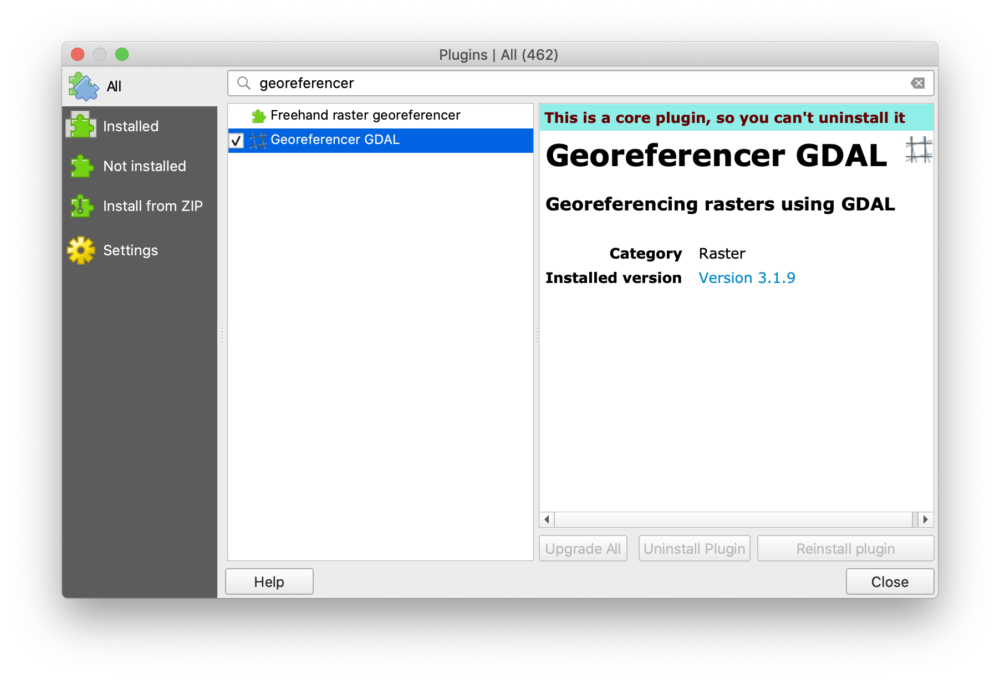
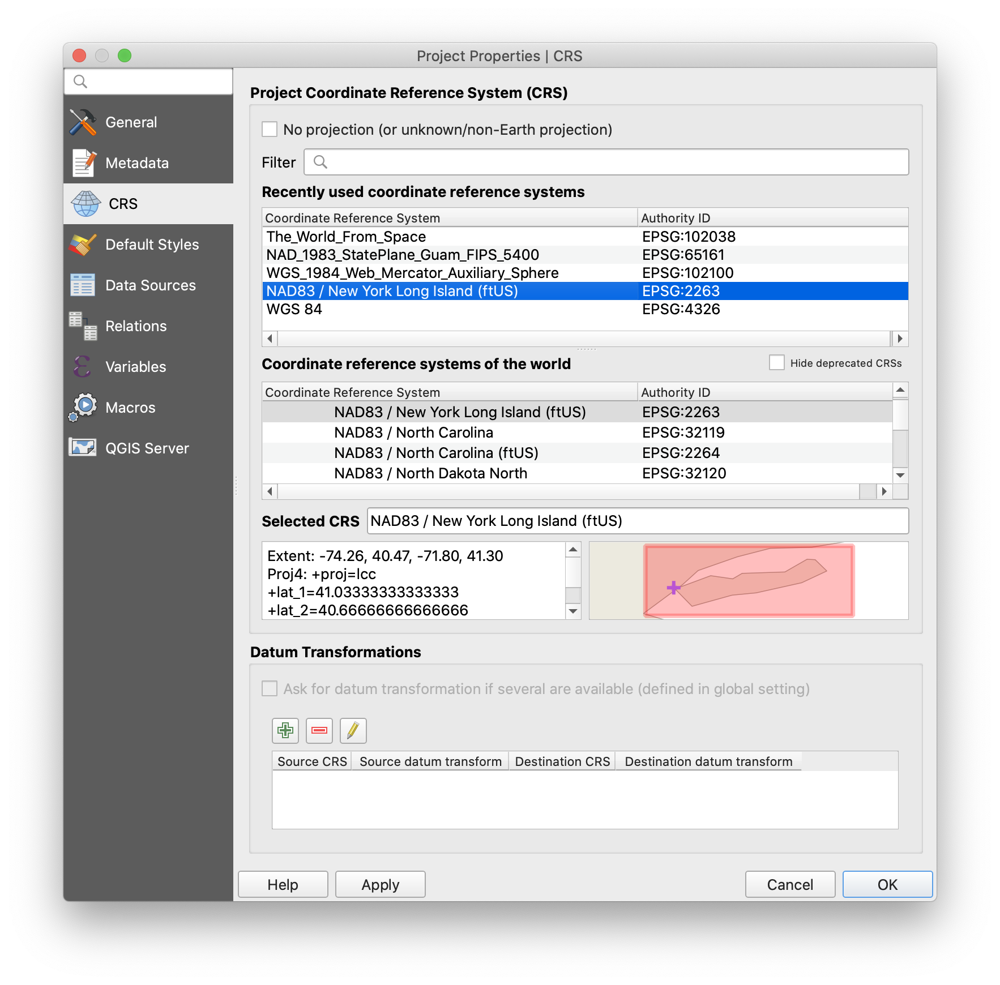
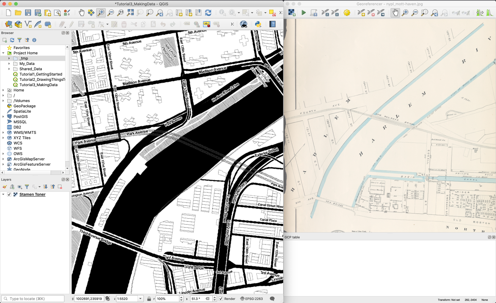
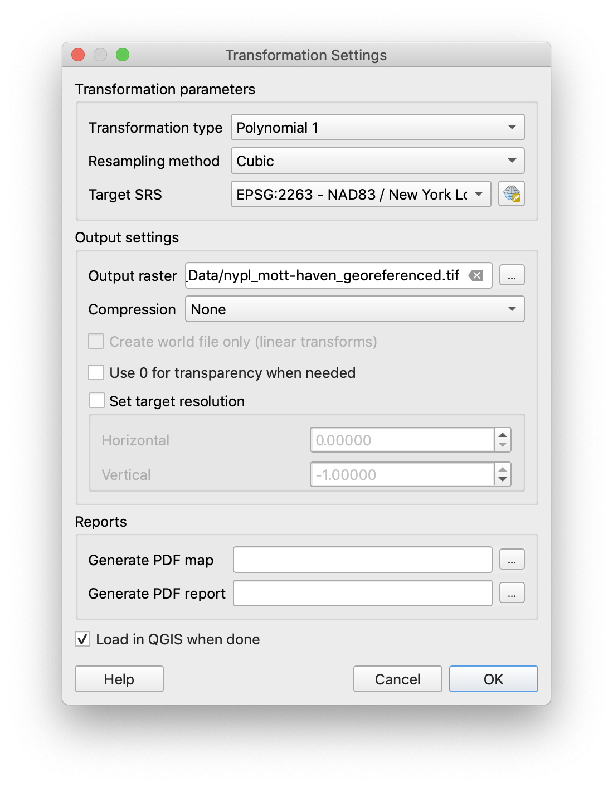
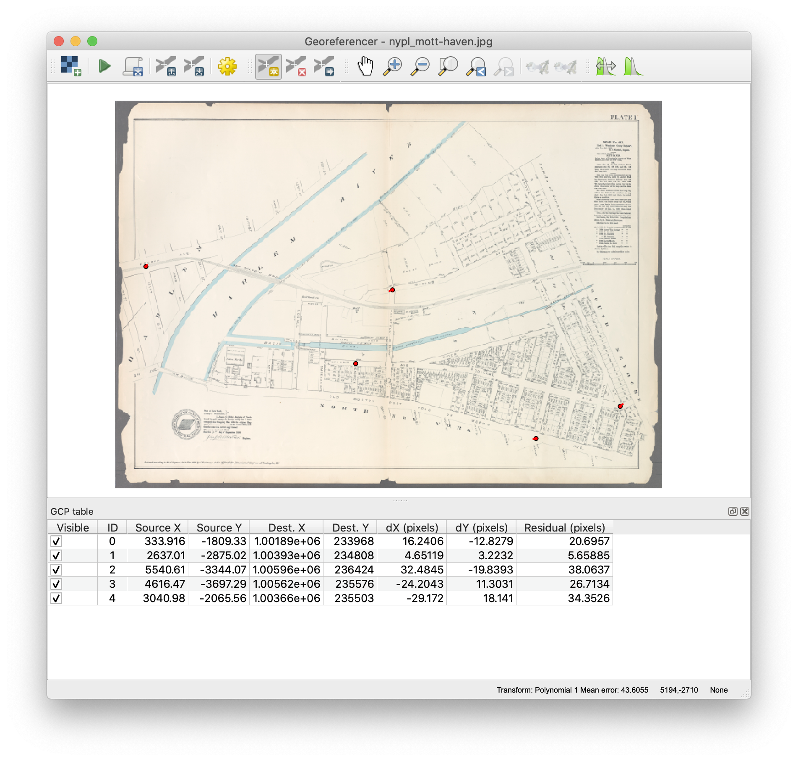
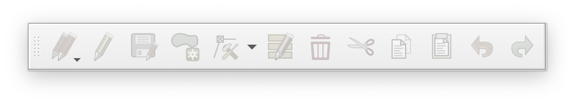
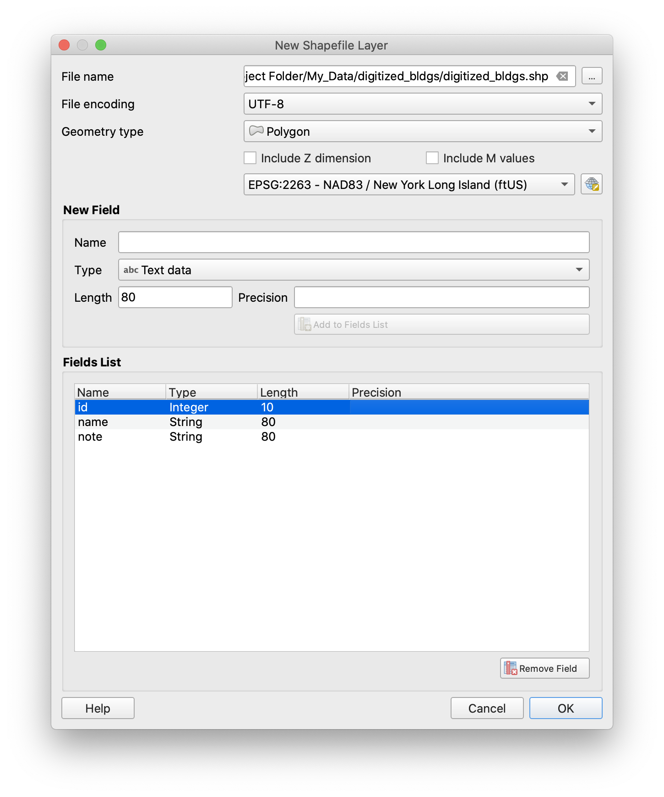
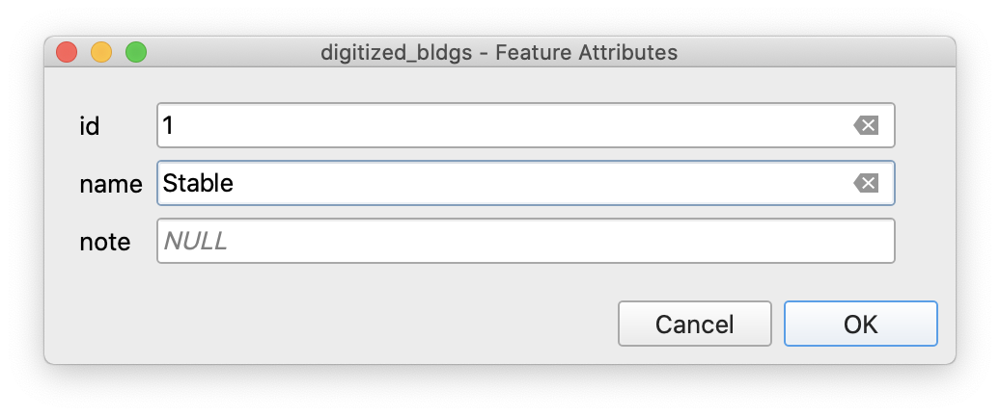
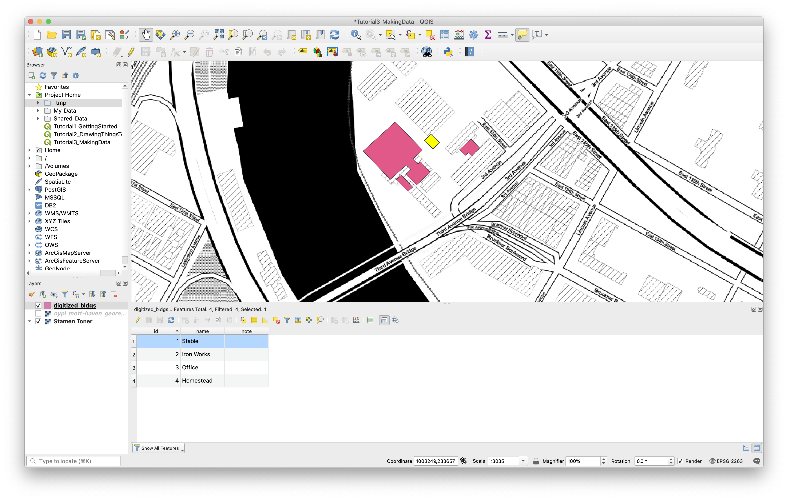

While a huge amount of spatial data is now freely available in digital form, it tends to focus on the present and excludes many of the subjects we may want to take on as mapmakers and researchers. To broaden the reach of what we're able to incorporate in our mappings, we'll often need to turn to archives and in-person field work to collect the necessary information.

In the first part of this tutorial, we'll learn to create spatial data from scanned paper maps. We'll start by first learning to position a scanned map correctly within the space of our map environment, and then learn to trace the elements it depicts to create new vector features. In the second part, we'll discuss how this same approach can be used to collect data from first-hand observation, by making a 'round trip' from our map project to printed map and back again. Finally, we'll discuss some challenges and benefits arising from the use of digital tools for field data collection.

## Georeferencing Scanned Paper Maps

Remember that in the first tutorial, the scanned map we used had already been retrieved from an archive, scanned, and **georectified** by another mapmaker. Unfortunately, this won't always be the case, so it's helpful to know how to do it ourselves.

Retrieval and scanning are pretty straightforward - the main requirement here is that you somehow locate a map of interest and obtain a high-quality digital copy (use a flatbed scanner!). But what does it mean for a scanned image to be georectified? Our problem is that even if a newly-created digital image depicts a map, the data contained with the image has no intrinsic spatial properties. The image is just a 2-dimensional grid of different-colored pixels without scale or location. If you're thinking this sounds like raster data, you're on the right track - we just need a way to assign spatial specificity to this grid of pixels so we can treat them as raster **cells**.

Assigning that specificity has two parts - first, if we know the **projection** of the map in the scanned image matches the projection of our software map environment, all we need to do is assign scale, rotation and position and each pixel in the image will then line up neatly with a corresponding cell in geographic space. We call this **georeferencing**. If the original map was drawn in a different projection, an additional step is required where the image is **warped** to match the desired projection. **Georectifying** refers to this complete process of scaling, rotating, positioning and warping the scanned image.

Let's open up a copy of the Tutorial 2 map and save it in our project folder as `Tutorial3_MakingData`. We're going to shift our area of focus slightly and create data from a scanned map of Mott Haven in the South Bronx, so you can remove all the layers except the Stamen Toner base map. Zoom out slightly and pan the map across the river to the area shown below.

Also find the `nypl_mott-haven.jpg` file in the Shared_Data folder and take a look. Before we can begin the process of aligning the image with our map environment, we'll also need to activate what QGIS calls its Georeferencer plugin by going to Plugins > Manage and Install Plugins... in the Menu Bar. Type "georeferencer" in the pop-up window's search bar, check the box and click Close.

Maps of New York City from the 20th century will pretty much always use what we call the "New York State Plane" projection, which is also likely to work well for earlier surveyed maps. Change the projection of your map environment to "NAD83 / New York Long Island (ftUS)" or `EPSG:2263` via the projection icon in the Status Bar or through Project Properties.

Finally, you can launch the Georeferencer via the menu bar under Raster > Georeferencer. A new window should appear. Click the "Add Raster" button at the upper left corner, and choose `nypl_mott-haven.jpg` from the file picker. Select the same `EPSG:2263` projection when prompted.

The Georeferencer works by having you pick corresponding points on both the scanned image and the main qgis map environment. Since this workflow relies on switching back and forth between two windows, it's a good idea to place them side-by-side on your screen and try to adjust the orientation (and rotation) of your map environment to match the scan like so:

Next click the green "Start Georeferencing" button and fill out the Transformation Settings window as shown, setting the output path to your "My_Data" folder:

You may have already noticed but there are some pretty substantial differences between the scanned map and the present-day version. One of the challenges in georeferencing historical maps is identifying with confidence which map elements can be trusted to align properly with their contemporary counterparts. Luckily for us, the New York City street grid is relatively constant so let's start there.

In the Georeferencing window, use the "Add Point" tool on the toolbar (look for a small yellow star) to place a point on the scanned map. You'll be prompted to "Enter Map Coordinates" but you can use the "From map canvas" button to pick a corresponding point in your map environment. When you click OK, you'll see a new entry in the "GCP Table" and a red point will appear on your reference location in both the main Map Panel and the Georeferencer.

Repeat this process until you have at least four reference points established (more is better!). Try to achieve a relatively even distribution of points across the space of the scanned map. If you're unsure of a point once it's been selected, you adjust its position with the Move GCP Point tool or simply delete it.

Once you have enough points set, click the "Start Georeferencing" button again and a georeferenced raster version of your scanned map will be created and added to the project. Note that the plugin also provides a toolbar button and menu item to "Save GCP Points" - if you have several versions of the same paper map (scanned at the same resolution) you can use this functionality to recycle georeferencing settings each time you import a new sheet.

You can check your results by adjusting the transparency of the new layer like we did in Tutorial 1. Getting a good result can be time-consuming, but you can usually get something decent without too much work.

## Digitizing Vector Features from a Georectified Map

Next we'll look at how to capture individual features based on our scanned, georectified map (now present in our project as a raster layer). We call this process **digitizing**.

Start by turning the layer opacity back to 100%. Next, make sure you have the Digitizing Toolbar present somewhere in your interface. It looks like this:

Creating new features one-by-one can be very time-consuming, but often it's the only way to get the data you need. Here we'll go through the basic steps needed to create new data in this way - you'll then be able to practice these new skills as you start collecting data for the final project.

The first step in creating a new dataset is to make a new vector layer for your features to live in. From the Menu Bar, choose "Layer > Create Layer > New Shapefile Layer...". You'll be prompted for a filename, data type and projection for the dataset as a whole, followed by a panel where you can specify the attribute fields you want in the dataset. For our exercise, we'll digitize a few of the buildings on the historic maps using a data structure like this: 

Note that the path to the new shapefile is in the My_Data folder, we're using a Polygon data type with text fields for a `name` and `note` for each feature. When you click OK, the new empty layer will be created and added to your project.  

Now, click on the newly created layer to activate it and then click the "Toggle Editing" button in the Digitizing Toolbar (look for a yellow pencil). Notice that the "Add Polygon Feature" tool becomes available now that you're in **edit mode**.

Zoom in so that one of the buildings on the scanned map takes up most of the screen, select the Add Polygon Feature tool and begin clicking points on the map to draw the polygon. You'll see a preview of the polygon show up in red as you draw. Once all points are selected, right-click anywhere on the map to finish drawing. You'll see a dialog appear where you'll be able to enter attribute information for the feature, which will be created when you click OK.

You can create as many features as needed by repeating this process. It's good practice to periodically "Save Layer Edits" in the Digitizing Toolbar. When you're done, click the Toggle Editing button again to save any outstanding edits and exit edit mode. Following the general pattern where QGIS operates on linked data, every time you save edits, the shapefile you created above will be updated directly. If you were using a remote data source, each "Save Layer Edits" operation would post these changes to the database.

One last feature worth mentioning that can help with the digitizing process is QGIS's Snapping Options. Access these from the Menu Bar under Project > Snapping Options. The settings here will allow you to specify where you want your cursor to 'snap' when picking points in the digitizer. The options panel will let you turn snapping on or off, which layers should trigger snaps, which kind of snapping to apply (vertex, segment or both - intersections are a separate option to the right) and a distance tolerance in either map units or screen units. Experiment with these options, sometimes they can be extremely helpful.

## Gathering Data from Field Observations

When conducting field research, using the right tools is extremely important. Depending on the task at hand, you might find yourself wanting to balance multiple considerations, for example:

- Accessibility to survey participants
- Flexibility of representation
- Device battery capacity
- Setup time required
- Spatial accuracy
- Consistency of survey data
- Manageability of high data volumes

Often in doing research in architecture and the humanities, our requirements skew more toward the higher items on the list, while those lower on the list are less of a concern. In these cases, digital tools like handheld GPS transponders, online forms and smartphone apps may be less appropriate than a printed map, clipboard and pencils/pens.

Using the Print Layout features covered in Tutorial 2 and the Georeferencing workflows covered here, you now have the ability to produce a simple base map, print it out, bring it with you into the field to record observations, and scan it back in to digitize the results. While this approach should be suitable for some work, students interested in exploring the use of handheld GPS as a data collection tool should see [this tutorial](https://github.com/CenterForSpatialResearch/gis_tutorials/blob/master/18_Collecting_And_Using_GPS_Data_To_Make_Maps.md) from the Center For Spatial Research. As participants in the course, you're able to check out handheld GPS receivers from the [GSAPP AV Office](https://www.arch.columbia.edu/audio-video-office) to use in your work.

**Assignment and Deliverable:** Before the beginning of the next class, create a spatial dataset that doesn't yet exist, but that can be produced through a single short session of field work or archival research. **Produce a simple map illustrating your work and upload it to the Deliverables folder.**

Your dataset can be produced using any combination of the methods above, and again, is not expected to be overly detailed or time-consuming to produce. The most important thing is that the subject of your data be interesting enough to you to continue working on as you develop your final project for the class. In the next session we'll use the datasets you create to explore strategies for static visualization.

---

Tutorial by Carsten Rodin, Spring 2020.

Adapted from materials from [Mapping for the Urban Humanities](https://github.com/CenterForSpatialResearch/mapping_for_the_urban_humanities), taught by Bernadette Baird-Zars, Eric Glass & Leah Meisterlin, Summer 2019.
