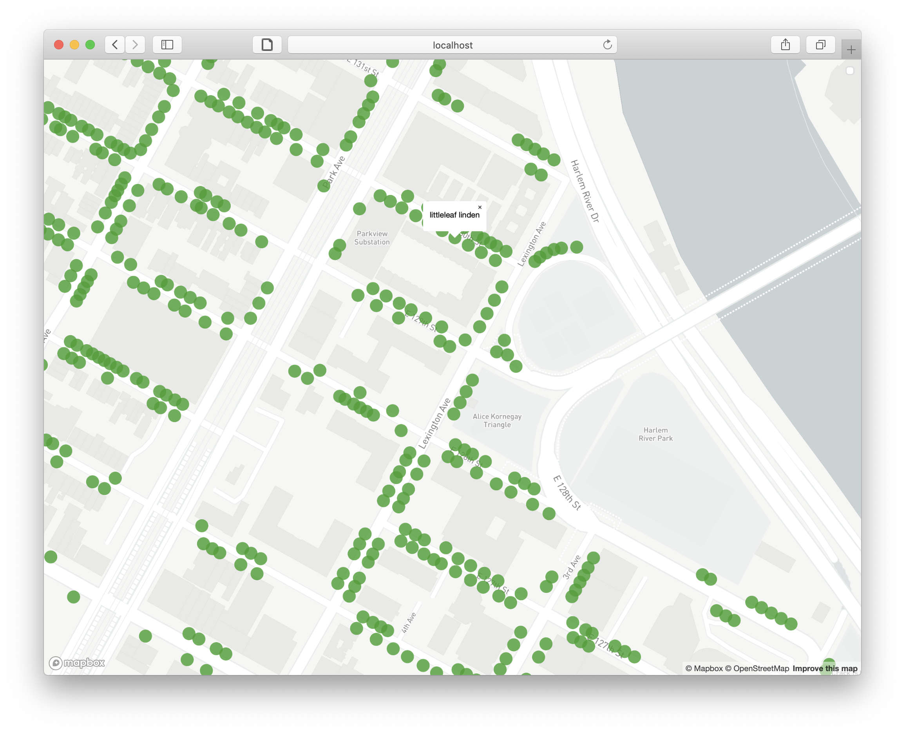

This final tutorial is totally optional and is meant to be a kind of a road map to where you might go next with your mapping practice.  We'll briefly cover how to make your map interactive with click events and animation, before ending with a list of resources, including map-related software tools/environments, data sources and archives, blogs and inspiration, online learning resources, and finally other mapping classes you can take here at Columbia.

Assuming you were successful with Tutorial 4, you now have a functioning web map. Congrats! With the help of some Javascript, we managed to get something similar to our QGIS static map onto the web by defining its content (raster and vector data) and style (symbology). Here we'll start to look at where Javascript really shines: defining behavior, interactivity and change over time in your web map.

## About Events

One of the simplest forms of interactivity is to have something happen when you click an element on the page, or in this case, our map. Javascript uses the concept of **events** to define this kind of behavior. This is a two-part approach: you first need to designate an element on your page as an event **listener**, then provide instructions in the form of an event **handler** that say what to do when the event takes place. A basic example would look something like this:

```javascript
// listen for 'onclick' events from 'handler-element'
document.getElementById('handler-element').onclick = handleEvent;

// say how to handle the events that are fired by the listener
function handleEvent(e) {
  console.log("an event happened")
}
```

Once the browser loads this bit of code, every time the user clicks a page element with the given ID an event will be fired and the code inside the event handler will be executed. We're not using it here but notice that the event handler is being passed an object `e` that we can use to get information about the element being clicked, where the cursor was on the screen at the time, and other useful things.

This is a good start but it's not going to get us very far when we're dealing with even a modestly-sized collection of map data. Consider the street trees we added to our web map in the last tutorial. If we wanted to create a pop-up label with the tree species every time a different tree was clicked, how would we do it?

Doing this with the pattern described above, we'd need to first create event listeners on each individual point. Even though we'd be able to reuse the same event handler function for each one, it'd also be a lot of work to, say, create a pop-up with the species name of the tree each time it was clicked. We'd need to first unpack the `e` object to access the properties of the clicked element, then relate it somehow to the original dataset, traverse the list of properties and get the value of the species name - all that before even starting to think about how to create and style a new page element with the name written in it, and to give ourselves some mechanism to make it go away once we don't want it anymore.

## Making Popups on Click Events with Mapbox GL

Fortunately, Mapbox GL provides us with a bunch of readymade objects and functions so we don't need to reinvent the wheel. Remember from last time that in order to create a map on our page we're making a new `Map` object using the library. We used `on('load', ...)`, which is an all-in-one event listener and handler, `addSource()` and `addLayer()` functions that are part of the `Map` object to describe and render the map. We can use different versions of that same `on()` function to automatically create event patterns for every element in a map layer, and Mapbox's `Popup` object can help us with creating the pop-up itself. Copy and paste the following sample code into your map.js file:

```javascript
// when the user does a 'click' on an element in the 'trees' layer...
map.on('click', 'trees', function(e) {
  // get the map coordinates of the feature
  var coordinates = e.features[0].geometry.coordinates.slice();
  // get its species name from the feature's attributes
  var species = e.features[0].properties.spc_common;

  // and create a popup on the map
  new mapboxgl.Popup()
  .setLngLat(coordinates)
  .setHTML(species)
  .addTo(map);
});
  
// make the cursor a pointer when over the tree
map.on('mouseenter', 'trees', function() {
  map.getCanvas().style.cursor = 'pointer';
});
  
// back to normal when it's not
map.on('mouseleave', 'trees', function() {
  map.getCanvas().style.cursor = '';
});
```

Now you should see a popup appear with the tree's species name whenever you click a tree on the map. Clicking another tree or clicking the 'x' on the popup should make the last popup disappear. Not bad for a couple lines of code. Notice that we can also control the appearance of the cursor to give the user a hint that some kind of interactivity is now built into the tree symbols. Thanks to the features in the library, we're able to do a surprising amount of work with just a couple of lines of code.



## Other Mapbox GL Examples

Now that we've seen the basics of how to define map behavior using functions in the Mapbox GL library, you can experiment with some of the many [examples](https://docs.mapbox.com/mapbox-gl-js/examples/) they provide and try to adapt them to your map. Here are a few suggestions:

- You can [adjust the opacity of a raster layer](https://docs.mapbox.com/mapbox-gl-js/example/adjust-layer-opacity/) using the `value` property of a targeted slider to as an input to the map's `setPaintProperty()` function. Note that this example uses the plain Javascript event pattern outlined above since the behavior is for a single element outside of the map itself.
- Or you can [animate features on the map](https://docs.mapbox.com/mapbox-gl-js/example/animate-point-along-line/) using two custom functions - one that defines position as a function of time and another which steps through frames of an animation, updating the position of an element with `Map.getSource(...).setData(...)` each time it runs.
- Or [animate the 'camera'](https://docs.mapbox.com/mapbox-gl-js/example/flyto-options/) with the `flyTo()` function which gradually changes the `center` and `zoom` properties of the `Map` over time.

## Using API Documentation

As you start thinking about how you might want to develop your map further, you'll want to know more about what else you can do with MapboxGL. At a certain point, working through examples and tutorials will cease to be useful and you'll want a more direct way to explore what's available. Fortunately, every legitimate Javascript library comes with a catalog in the form of its **API documentation**. Sometimes you'll see this referred to as "the docs" for short, and it's always going to be the most detailed, comprehensive, up-to-date, and accurate source for information on the contents of a given library and how it's meant to be used.

All of the objects, functions and properties in the library will be listed and described, often with examples, in a single online resource. So for example, if you wanted more details on how the `flyTo` function in the last example, you'd find it [here](https://docs.mapbox.com/mapbox-gl-js/api/#map#flyto) under the instance members of the Map object. Not all API docs will do this, but Mapbox includes both links to related examples and short code snippets, which makes it even easier to learn. Feel free to explore this at your own pace and try adding some additional functionality to your map if you have the time and interest.

---

The rest of this page provides a kind of partially-annotated bibliography of mapping resources - it's by no means exaustive but hopefully it'll help each of you identify some new territory for exploration as you continue your journey with critical mapping. While we've talked a lot in the last six weeks about what this might look like, our conversations will hopefully start to become much more meaningful as you start to approach it in your work.

## Software Tools and Environments

### Desktop GIS Software

- [QGIS](https://www.qgis.org/en/site/) - Used in the tutorials!
- [ArcGIS](https://en.wikipedia.org/wiki/ArcGIS) - Commercial GIS software you're likely to find in corporate settings & government agencies. Licenses are very expensive so generally not recommended for personal use.

### Javascript Libraries for Web Mapping and Data Visualization

- [GitHub Pages](https://pages.github.com) - Not a javascript library but one of the easiest ways to publish a static website. (Used in Tutorials)
- [Mapbox GL](https://docs.mapbox.com/mapbox-gl-js/api/) - From the Tutorials!
- [OpenLayers](https://openlayers.org) - Yet another open-source map library. Support for many different raster and vector data sources.
- [Tangram](https://github.com/tangrams/tangram) - Another WebGL-based map library which lets you define custom styles directly rather than depending on vector tiles like Mapbox.
- [Leaflet](https://leafletjs.com) - Open-Source javascript library for easy web maps, somewhat similar in functionality to Mapbox GL but not as good-looking.
- [D3](https://d3js.org) - Slightly complicated but very flexible library for interactive data visualization.

### Jupyter Notebooks

[These](https://jupyter.org) are beyond the scope of our 6-week class but provide a third category of environment for spatial data analysis. Here your workspace is a 'notebook' that combines blocks of text with code snippets (usually in Python or R) that share a common computational environment. Using different libraries, code snippets can also generate interactive, data-driven visualizations. Mostly these are used in more quantitative/programming-heavy workflows that deal with large datasets or complex computational requirements. If you're interested in working with census data or machine learning, this is a good space to explore.

## Data Sources & Archives

- [NYC Open Data](https://opendata.cityofnewyork.us) - Look at other cities' open data collections as well.
- [Census Bureau Data](https://data.census.gov/cedsci/) - The [American Community Survey](https://en.wikipedia.org/wiki/American_Community_Survey) and [Decennial Census](https://en.wikipedia.org/wiki/United_States_Census) provide detailed demographic information at a wide range of geographic scales.
- [IPUMS](https://ipums.org) - Aggregated census and survey data from around the world and across time.
- [EarthExplorer](https://earthexplorer.usgs.gov) - Provides access to whole-earth raster data from the [Landsat](https://en.wikipedia.org/wiki/Landsat_program) missions.
- [Columbia Geodata Portal](https://geodata.library.columbia.edu)
- [Columbia Lehman Library Map Collection](https://library.columbia.edu/libraries/maps.html)
- [NYPL Map Division](https://www.nypl.org/about/divisions/map-division)
- [David Rumsey Historical Map Collection](https://www.davidrumsey.com)

## Learning Resources

- [Columbia for Spatial Research Tutorials ](https://c4sr.columbia.edu/tutorials)
- [Programming Historian](https://programminghistorian.org/en/)
- [Baruch College Newman Library GIS Guides](https://guides.newman.baruch.cuny.edu/gis)
- [Empirical Reasoning Center at Barnard](https://erc.barnard.edu)
- [Studio@Butler](https://studio.cul.columbia.edu) - Our temporary home, otherwise a great resource for all kinds of digital humanities stuff.
- [Web Developer Roadmap](https://github.com/kamranahmedse/developer-roadmap) - As this will show you, web development is a huge topic with many different areas of specialization. This is a good structured overview of what's out there when/if you choose to go beyond the simple static site setup we used in the tutorials.
- [GIS StackExchange](https://gis.stackexchange.com) - StackExchange and related sites (StackOverflow for code/programming topics) are a great resource, especially for open-source GIS tools like QGIS which tend to be less rigorously documented than their commercial counterparts.  However, you need to be careful that specific solutions you find here are relevant to the version of the software you're using - comments and threads here are usually more useful at a broader conceptual level than as a way to find viable examples and instructions. Look to the official documentation for these kinds of things as they'll almost always be more up-to-date.

## Blogs, Inspiration

- [Atlas of Places](https://www.atlasofplaces.com)
- [Urban Omnibus](https://urbanomnibus.net/)
- [BLDGBLOG](http://www.bldgblog.com)
- [Geoawesomeness](https://geoawesomeness.com)
- There's also plenty of map-related content on [are.na](https://are.na), Twitter, Instagram...
  
## Classes

- [Introduction to GIS](https://urban.barnard.edu/courses-instruction) (Barnard)
- [GIS, Resiliency, Environment, Infrastructure Management](http://www.columbia.edu/cu/bulletin/uwb/#/cu/bulletin/uwb/subj/EAEE/E4009-20191-B01) (Earth Institute)
- [Geographic Information Systems](https://www.arch.columbia.edu/courses/41514-2483) (GSAPP)
- [Advanced Spatial Analysis](https://www.arch.columbia.edu/courses/11496-2790-advanced-spatial-analysis) (GSAPP)
- [Mapping for Architecture Urbanism and Humanities](https://www.arch.columbia.edu/courses/14051-2826) (GSAPP)
- [European Urban Cartography](https://www.arch.columbia.edu/courses/11355-2746) (GSAPP)

---

There's no **deliverable** for this tutorial - just come to class Friday ready to talk about what you've been working on and have a discussion with the group about what you'd like to pursue next!